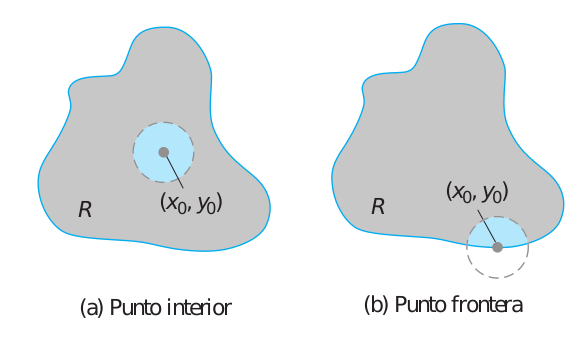
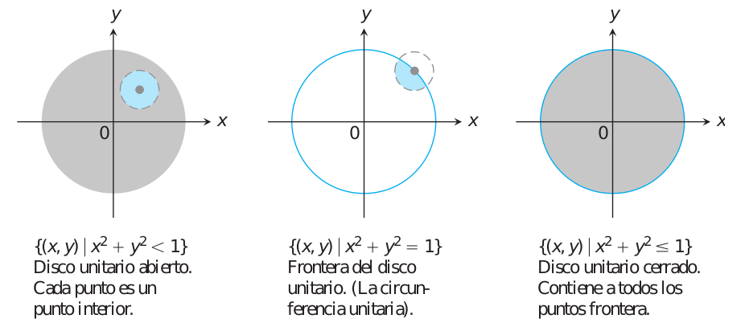
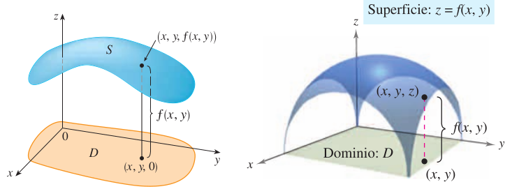
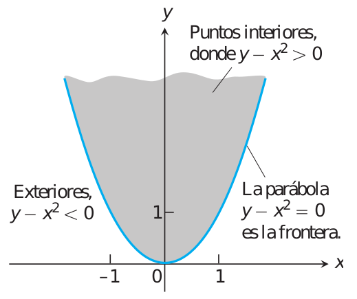
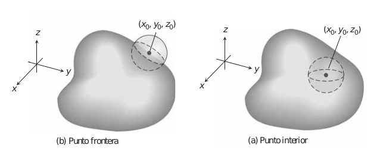

# Introducción {#intro}


```{r,echo=FALSE,message=FALSE,warning=FALSE}
library(pracma)
library(plotly)
library(leaflet)
```

<!-- https://www.lifeder.com/wp-content/uploads/2017/01/alan-turing.jpg -->


<!-- https://www.lifeder.com/wp-content/uploads/2016/11/Ren%C3%A9-Descartes.jpg -->


<div align="center">
<figure>
  

  <figcaption>René Descartes (1596-1650).</figcaption>
</figure>
</div>


<!-- <a href="https://www.lifeder.com/wp-content/uploads/2016/11/Ren%C3%A9-Descartes.jpg"><div align="center"></div></a> -->


```{r FigIntruccionA001, fig.cap="Gráfica punto frontera y punto interior de una región en el plano $XY$ [Imagen tomada de [@thomas2003thomas] pág $967$]", fig.align='center' ,echo=FALSE, message=FALSE,  warning=FALSE, out.width = "65%"}

```


## Punto frontera y punto interior en el plano


```{definition}
Un punto $(x_0,y_0)$ en una región (conjunto) $R$ del plano $XY$ es un punto interior de $R$ si es el centro de un disco de radio positivo que está completamente dentro de $R$. Un punto $(x_0,y_0)$ es un punto frontera de $R$ si cada disco con centro en $(x_0,y_0)$ contiene puntos que están fuera de $R$ y puntos que están en $R$. (El punto frontera no tiene que pertenecer a $R$).

Los puntos interiores de una región conforman (como conjunto) el interior de la región. Los puntos frontera de una región conforman su frontera. Una región es abierta si consta sólo de puntos interiores. Una región es cerrada si contiene todos sus puntos frontera.

tomada de [@thomas2003thomas] pág $967$
```


```{r FigIntruccionA002, fig.cap="Puntos interiores y puntos frontera del disco unitario en el plano $XY$ [Imagen tomada de [@thomas2003thomas] pág $967$]", fig.align='center' ,echo=FALSE, message=FALSE,  warning=FALSE, out.width = "65%"}

```


```{definition}
Una región en el plano está acotada si está dentro de un disco de radio fijo. Una región es no acotada si no tiene fronteras.

tomada de [@thomas2003thomas] pág $967$
```


## Función de dos variables


```{r FigIntruccionB001, fig.cap="Gráfica de una función de dos variables en el espacio $XYZ$ [Imagen tomada de [@larson1999calculo] pág $888$ y [@stewart2009calculus] pág $277$", fig.align='center' ,echo=FALSE, message=FALSE,  warning=FALSE, out.width ="65%"}

```


```{definition}
Sea $D$ un conjunto de pares ordenados donde cada par ordenado esta compuesto de números reales. Si a cada par ordenado $(x,y)$ en $D$ le corresponde un único real $f(x,y)$, entonces se dice que $f$  es una **función** de $x$ y $y$. El conjunto $D$ es el dominio de $f$, y el correspondiente conjunto de valores $f(x,y)$ es el **rango** de $f$  [Tomado de [@larson2006calculo] pág $886$]
```


$$
D\subseteq R^2 \longrightarrow R\\
\ \ \ \ \ \ \ \ \ \ \ \ \ \ \ \ \ (x,y) \ \ \longmapsto \ z=f(x,y)
$$


```{example}
Describa el dominio de la función

$$
f(x,y)=2\sqrt{y-x^2}  
$$


```


```{solution}
Como $f$ esta definidad sólo cuando $y-x^2 \geq 0$, el dominio es la región cerrada, no acotada, que aparece en la gráfica parte inferior. La parábola es la frontera del dominio. Los puntos sobre la parábola son parte del dominio y conforman la frontera.
```


```{r FigIntruccionA003, fig.cap="Gráfica dominio de una función con dos variables en el plano $XY$ [Imagen tomada de [@thomas2003thomas] pág $968$]", fig.align='center' ,echo=FALSE, message=FALSE,  warning=FALSE, out.width = "45%"}

```


## Punto frontera y punto interior en el espacio


```{r FigIntruccionA004, fig.cap="Gráfica punto frontera y punto interior de una región en el espacio $XYZ$ [Imagen tomada de [@thomas2003thomas] pág $970$]", fig.align='center' ,echo=FALSE, message=FALSE,  warning=FALSE, out.width = "65%"}

```


```{definition}
Un punto $(x_0,y_0,z_0)$ en una región (conjunto) $R$ del espacio $XYZ$ es un punto interior de $R$ si es el centro de una bola sólida de radio positivo que está completamente dentro de $R$. Un punto $(x_0,y_0,z_0)$ es un punto frontera de $R$ si toda esfera con centro en $(x_0,y_0,z_0)$ contiene puntos que están fuera de $R$ y puntos que están en $R$. (El punto frontera no tiene que pertenecer a $R$).

Los puntos interiores de una región conforman (como conjunto) el interior de la región. Los puntos frontera de una región conforman su frontera. Una región es abierta si consta sólo de puntos interiores. Una región es cerrada si contiene todos sus puntos frontera.

tomada de [@thomas2003thomas] pág $970$
```


## Detalles de una superficie en el espacio $XYZ$


```{definition}
La traza de una superficie en cualquier plano es la curva formada por la intersección de la superficie con el plano correspondiente.
```

<meta name=viewport content="width=device-width,initial-scale=1">
<meta charset="utf-8"/>
<script src="https://www.geogebra.org/apps/deployggb.js"></script>
<div id="ggb-elementSuperficie03"></div> 
<script>  
       var ggbAppSuperficie03 = new GGBApplet({"material_id":"eavcyd2y",
       "width": 1400,
       "height": 600,
       "showToolBar": false,
       "showAlgebraInput": false,
       "showMenuBar": false },
       true);
       
         window.addEventListener("load", function() {  
           ggbAppSuperficie03.inject('ggb-elementSuperficie03');
      });
</script>


<br></br>


```{definition}
El conjunto de puntos $(x,y,z)$ en el espacio donde una función de tres variables independientes tiene un valor constante $f(x,y,z)=c$, es una superficie de nivel de $f$
  
NOTA: También se puede definir como la proyección perpendicular de una traza en uno de los planos coordenados del espacio $XYZ$.
```


Esta es una aplicación para generar una esfera, el Autor:John Jairo Estrada (https://www.geogebra.org/classic/jermjgqh) la elaboro usando geogebra.

<meta name=viewport content="width=device-width,initial-scale=1">
<meta charset="utf-8"/>
<script src="https://www.geogebra.org/apps/deployggb.js"></script>
<div id="ggb-elementSuperficie06"></div> 
<script>  
       var ggbAppSuperficie06 = new GGBApplet({"material_id":"jermjgqh",
       "width": 900,
       "height": 600,
       "showToolBar": false,
       "showAlgebraInput": false,
       "showMenuBar": false },
       true);
       
         window.addEventListener("load", function() {  
           ggbAppSuperficie06.inject('ggb-elementSuperficie06');
      });
</script>


## Curvas de nivel para el Pueblito Paisa de Medellín


```{r ,echo=FALSE,fig.align="center",label="pueblito paisa de medellín",out.width="80%",fig.cap='Carta topografica del Pueblito Paisa Medellín'}
leaflet() %>%
  addTiles(urlTemplate="//{s}.tile.opentopomap.org/{z}/{x}/{y}.png") %>%
  addMarkers(lat = 6.236098766, lng = -75.580085754, popup = "Pueblito Paisa de Medellín")
```


## Curvas de nivel para la UCES de Medellín


```{r ,echo=FALSE,fig.align="center",label="Universidad CES de medellín",out.width="80%",fig.cap='Carta topografica de la Universidad CES de Medellín'}
leaflet() %>%
  addTiles(urlTemplate="//{s}.tile.opentopomap.org/{z}/{x}/{y}.png") %>%
  addMarkers(lat = 6.20859975, lng = -75.5526154108008, popup = "Pueblito Paisa de Medellín")
```

