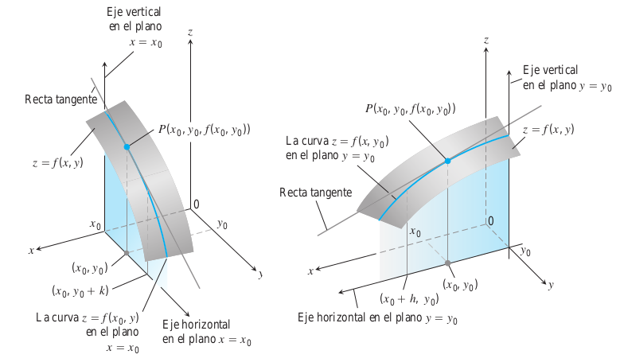
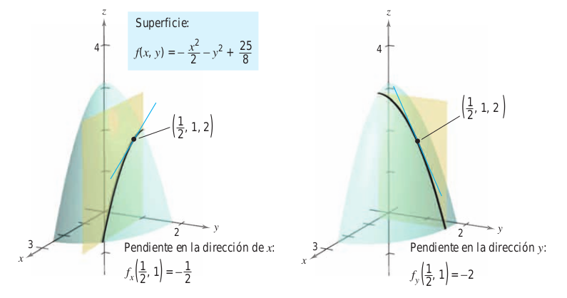
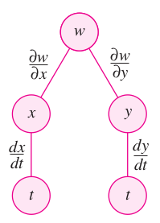
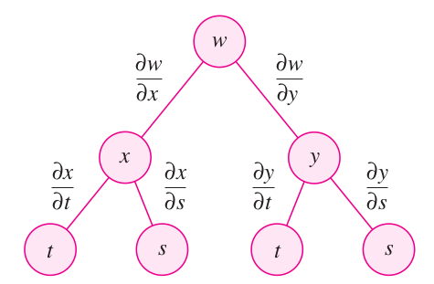
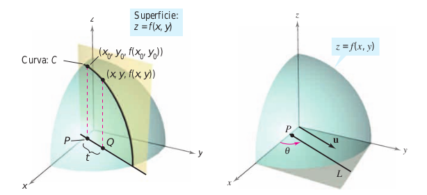
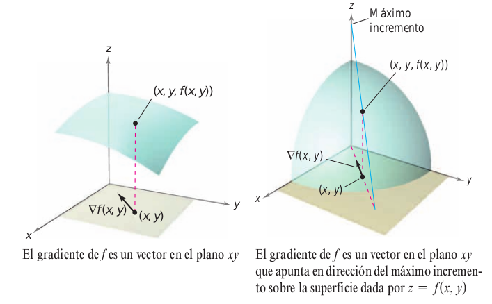

# Métodos para derivar parcialmente


<!-- https://www.lifeder.com/wp-content/uploads/2017/01/newton.jpg -->

<div align="center">
<figure>
  

  <figcaption>Isaac Newton (1642-1727).</figcaption>
</figure>
</div>


<!-- <a href="https://www.lifeder.com/wp-content/uploads/2017/01/newton.jpg"><div align="center"></div></a> -->

## Definición derivada parcial

```{definition}
Si $z=f(x,y)$, las primeras derivadas parciales de $f$ con respecto a $x$ y $y$ son las funciones $f_x$ y $f_y$ definidas por:
  
$$
f_x(x,y)=\displaystyle\lim_{{\parallel \bigtriangleup{x}\parallel} \to 0}{\dfrac{f(x+\bigtriangleup{x},y)-f(x,y)}{ \bigtriangleup{x}}}
$$
\[
f_y(x,y)=\displaystyle\lim_{{\parallel \bigtriangleup{y}\parallel} \to 0}{\dfrac{f(x,y+\bigtriangleup{y})-f(x,y)}{ \bigtriangleup{y}}}
\]

Siempre y cuando el límite exista.
```


## Ejercicio derivada parcial con respecto a $x$


```{exercise}
Sea 
$$
f(x,y)=5x-4x^3y^2-4sen(x)
$$
Obtener la derivada parcial de $f$ con respecto a $x$.
```


<br></br> 


Importante, y clave para realizar la derivada parcial con respecto a $x$ es que se debe, considerar que las expresiones en $y$ se comportan como constantes
$$
f_x(x,y)=5-12x^2y^2-4cos(x)
$$

Puede también ver la respuesta de este ejercicio en [@larson1999calculo] pág $908$]


## Ejercicio derivada parcial con respecto a $y$


```{exercise}
Sea 
$$
f(x,y)=5x-4x^3y^2-4sen(x)
$$
Obtener la derivada parcial de $f$ con respecto a $y$.
```


<br></br>


Importante, y clave para realizar la derivada parcial con respecto a $y$ es que se debe, considerar que las expresiones en $x$ se comportan como constantes
$$
f_x(x,y)=-8x^3y^1
$$

Puede también ver la respuesta de este ejercicio en [@larson1999calculo] pág $908$]


<br></br>

## Notación (ó simbología) de la derivada parcial


La derivadas parciales tienen la siguiente simbología (ó notación)

$$
f_x(x,y)=z_x=\dfrac{\partial z}{\partial x}=\dfrac{\partial}{\partial x}f(x,y)
$$
$$
f_y(x,y)=z_y=\dfrac{\partial z}{\partial y}=\dfrac{\partial}{\partial y}f(x,y)
$$
  
Las primeras derivadas parciales evaluadas en el punto $(a,b)$ se denotan por:
  
$$
\left.\dfrac{\partial z}{\partial x}\right|_{(a,b)}=f_{x}(a,b)
$$
$$
\left.\dfrac{\partial z}{\partial y}\right|_{(a,b)}=f_{y}(a,b)
$$


<br></br>

## Significado geométrico de la derivada parcial con respecto a $x$ y $y$

```{r FigDerivadaParcialA1, fig.cap="Significado de la derivada parcial [Imagen tomada de [@thomas2003thomas] pág $995$ y $996$]", fig.align='center' ,echo=FALSE, message=FALSE,  warning=FALSE, out.width = "85%"}

```


<br></br>


## Ejercicio Pendiente de una superficie


```{exercise}
Sea 
$$
f(x,y)=-\dfrac{x^2}{2}-y^2+\dfrac{25}{8}
$$
Hallar las pendientes en las direcciones de $x$ y de $y$ para la superficie dada por $z=f(x,y)$ en el punto $\left(\dfrac{1}{2},1,2\right)$.
```


<br></br>


Las derivadas parciales de $f$ con respecto a $x$, y a $y$ son:
$$
f_{x}(x,y)=-x \ \ \ \ \ \ \text{ y } \ \ \ \ \ \ f_{y}(x,y)=-2y 
$$
Las pendientes con respecto a $x$, y a $y$ son:
  $$
f_{x}\left(\dfrac{1}{2},1\right)=-\dfrac{1}{2} \ \ \ \ \ \ \text{ y } \ \ \ \ \ \ f_{y}\left(\dfrac{1}{2},1\right)=-2 
$$
Puede también ver la respuesta de este ejercicio en [@larson1999calculo] pág $908$]


<br></br>


```{r FigPendienteDerivadaParcialA1, fig.cap="Ejemplo de pendientes y significado de la derivada parcial [Imagen tomada de [@larson2006calculo] pág $910$]", fig.align='center' ,echo=FALSE, message=FALSE,  warning=FALSE, out.width = "75%"}

```


<br></br>

## Herramienta para evaluar primeras derivadas parciales en $(a,b)$

Esta es una aplicación para generar derivadas parciales en un punto del plano $XY$, el Autor:John Jairo Estrada (https://www.geogebra.org/classic/vevfbdws) la elaboro usando geogebra.


<div align='center'>
<meta name=viewport content="width=device-width,initial-scale=1">
<meta charset="utf-8"/>
<script src="https://www.geogebra.org/apps/deployggb.js"></script>
<div id="ggb-elementDerivaParcialA01"></div> 
<script>  
       var ggbAppDerivaParcialA01 = new GGBApplet({"material_id":"vevfbdws",
       "width": 400,
       "height": 300,
       "showToolBar": false,
       "showAlgebraInput": false,
       "showMenuBar": false },
       true);
       
         window.addEventListener("load", function() {  
           ggbAppDerivaParcialA01.inject('ggb-elementDerivaParcialA01');
      });
</script>
</div>

<br></br>


```{theorem}
Suponga que las primeras derivadas parciales de $f(x,y)$ están definidas en una región abierta $D$ que contiene el punto $(x_0,y_0)$ y que $f_x$ y $f_y$ son continuas en $(x_0,y_0)$. Entonces el cambio

$$
\bigtriangleup{z}=f(x_0+\bigtriangleup{x},y_0+\bigtriangleup{y})-f(x_0,y_0)  
$$
en el valor de $f$, resultante de moverse de $(x_0,y_0)$ a otro punto $(x_0+\bigtriangleup{x},y_0+\bigtriangleup{y})$ en $D$, satisface una ecuación de la forma

$$
\bigtriangleup{z}=f_{x}(x_0,y_0)\bigtriangleup{x}+f_{y}(x_0,y_0)\bigtriangleup{y}+{\epsilon}_{1}\bigtriangleup{x}+{\epsilon}_{2}\bigtriangleup{y}
$$
donde cada ${\epsilon}_1$,${\epsilon}_2 \to 0$, cuando $\bigtriangleup{x}$, ${\bigtriangleup{y} \to 0}$. 
 [@thomas2003thomas] pág $993$]
```

<br></br>

```{definition}
Una función $z=f(x,y)$ es diferenciable en $(x_0,y_0)$ si $f_{x}(x_0,y_0)$ y $f_{y}(x_0,y_0)$ existen y $\bigtriangleup{z}$ satisface una ecuación de la forma

$$
\bigtriangleup{z}=f_{x}(x_0,y_0)\bigtriangleup{x}+f_{y}(x_0,y_0)\bigtriangleup{y}+{\epsilon}_{1}\bigtriangleup{x}+{\epsilon}_{2}\bigtriangleup{y}
$$
donde cada ${\epsilon}_1$,${\epsilon}_2 \to 0$, cuando $\bigtriangleup{x}$, ${\bigtriangleup{y} \to 0}$. Decimos que $f$ es diferenciable si es diferenciable en cada punto de su dominio.

 [@thomas2003thomas] pág $993$]
```


<br></br>
```{corollary}
Si las derivadas parciales de primer orden de una funcón $f$ en las variables $x$ y $y$ son continuas en toda una región abierta $D$, entonces $f$ es diferenciable en cada punto de $D$.
```


<br></br>

```{theorem}
Si una función $f(x,y)$ es diferenciable en $(x_0,y_0)$, entonces $f$ es continua en $(x_0,y_0)$.
```

<br></br>


## Derivadas parciales de orden superior


Como sucede con las derivadas ordinarias, es posible hallar las segundas, terceras, etc., derivadas parciales de una función de varias variables, siempre que tales derivadas existan. Las derivadas de orden superior se denotan por el orden al que se hace la derivación.

$$
\dfrac{\partial}{\partial x}\left(\dfrac{\partial f}{\partial x}\right)=\dfrac{{\partial}^2f}{\partial x^2}=f_{xx} \ \ \ \ \ \ \text{ ; } \ \ \ \ \ \ \dfrac{\partial}{\partial y}\left(\dfrac{\partial f}{\partial y}\right)=\dfrac{{\partial}^2f}{\partial y^2}=f_{yy} 
$$
$$
\dfrac{\partial}{\partial y}\left(\dfrac{\partial f}{\partial x}\right)=\dfrac{{\partial}^2f}{\partial{y}\partial{x} }=f_{xy} \ \ \ \ \ \ \text{ ; } \ \ \ \ \ \ \dfrac{\partial}{\partial x}\left(\dfrac{\partial f}{\partial y}\right)=\dfrac{{\partial}^2f}{\partial{x}\partial{y}}=f_{yx} 
$$


<br></br>


## Ejercicio derivadas parciales de orden superior


```{exercise}
Sea 
$$
f(x,y)=3xy^2-2y+5x^2y^2
$$
Hallar las derivadas parciales de orden uno y dos para $z=f(x,y)$ en el punto $\left(-1,2\right)$.
```


<br></br>


Las derivadas parciales de primer orden para $f$ con respecto a $x$, y a $y$ son:
$$
f_{x}(x,y)=3y^2+10xy^2 \ \ \ \ \ \ \text{ y } \ \ \ \ \ \ f_{y}(x,y)=6xy-2+10x^2y 
$$
Las derivadas parciales de orden dos para $f$ con respecto a $x$, y a $y$ son:
$$
f_{xx}(x,y)=10y^2 \ \ \ \ \ \ \text{ y } \ \ \ \ \ \ f_{yy}(x,y)=6x+10x^2 
$$
$$
f_{xy}(x,y)=6y+20xy \ \ \ \ \ \ \text{ y } \ \ \ \ \ \ f_{yx}(x,y)=6y+20xy 
$$
Puede también ver la respuesta de este ejercicio en [@larson1999calculo] pág $908$]


<br></br>

## Herramienta para evaluar derivadas parciales de orden dos en $(a,b)$

Esta es una aplicación para generar derivadas parciales de segundo orden en un punto del plano $XY$, el Autor:John Jairo Estrada (https://www.geogebra.org/classic/derwhqkk) la elaboro usando geogebra.


<div align='center'>
<meta name=viewport content="width=device-width,initial-scale=1">
<meta charset="utf-8"/>
<script src="https://www.geogebra.org/apps/deployggb.js"></script>
<div id="ggb-elementDerivaParcialA02"></div> 
<script>  
       var ggbAppDerivaParcialA02 = new GGBApplet({"material_id":"derwhqkk",
       "width": 600,
       "height": 300,
       "showToolBar": false,
       "showAlgebraInput": false,
       "showMenuBar": false },
       true);
       
         window.addEventListener("load", function() {  
           ggbAppDerivaParcialA02.inject('ggb-elementDerivaParcialA02');
      });
</script>
</div>

<br></br>


```{theorem}
Si $f$  es una función de $x$ y $y$ tal que $f_{xy}$ y $f_{yx}$ son continuas en un disco abierto $D$, entonces, para toda pareja $()x,y$ en $D$,

$$
f_{xy}(x,y)=f_{yx}(x,y)  
$$


[Tomado de [@larson2006calculo] pág $913$]
```

<br></br>


## Regla de la cadena para funciones de varias variables

### Una variable independiente


```{r FigPendienteDerivadaParcialA2, fig.cap="Esquema regla de la cadena: una variable independiente [Imagen tomada de [@larson2006calculo] pág $925$]", fig.align='center' ,echo=FALSE, message=FALSE,  warning=FALSE, out.width = "25%"}

```


```{theorem}
Sea $w=f(x,y)$, donde $f$  es una función derivable de $x$ y $y$. Si $x=g(t)$ y $y=h(t)$, donde $g$ y $h$ son funciones derivables en $t$, entonces $w$ es una función diferenciable de $t$, y 

$$
\dfrac{dw}{dt}=\dfrac{\partial{w}}{\partial{x}}\dfrac{dx}{dt}+\dfrac{\partial{w}}{\partial{y}}\dfrac{dy}{dy}
$$


[Tomado de [@larson2006calculo] pág $925$]
```

<br></br>


Si $w$ es una función diferenciable de $n$ variables $x_1,x_2,...,x_n$, y si cada $x_i$ es una función de una sola variable $t$, entonces para $w=f(x_1,x_2,...,x_n)$ se tiene:
  
$$
\dfrac{dw}{dt}=\dfrac{\partial{w}}{\partial{x_1}}\dfrac{dx_1}{dt}+\dfrac{\partial{w}}{\partial{x_2}}\dfrac{dx_2}{dt}+...+\dfrac{\partial{w}}{\partial{x_n}}\dfrac{dx_n}{dt}
$$


<br></br>

### Dos variables independientes


```{r FigPendienteDerivadaParcialA3, fig.cap="Esquema regla de la cadena: dos variables independientes [Imagen tomada de [@larson2006calculo] pág $927$]", fig.align='center' ,echo=FALSE, message=FALSE,  warning=FALSE, out.width = "45%"}

```


```{theorem}
Sea $w=f(x,y)$, donde $f$  es una función derivable de $x$ y $y$. Si $x=g(s,t)$ y $y=h(s,t)$, donde $g$ y $h$ son funciones tales que las derivadas parciales de primer orden con respecto a $s$ y $t$ existen, entonces $\partial{w}/\partial{s}$,$\partial{w}/\partial{t}$ existen y estan dadas por: 

$$
\dfrac{\partial{w}}{\partial{s}}=\dfrac{\partial{w}}{\partial{x}}\dfrac{\partial{x}}{\partial{s}}+\dfrac{\partial{w}}{\partial{y}}\dfrac{\partial{y}}{\partial{s}}
$$
$$
\dfrac{\partial{w}}{\partial{t}}=\dfrac{\partial{w}}{\partial{x}}\dfrac{\partial{x}}{\partial{t}}+\dfrac{\partial{w}}{\partial{y}}\dfrac{\partial{y}}{\partial{t}}
$$

[Tomado de [@larson2006calculo] pág $925$]
```

<br></br>


Si $w$ es una función diferenciable de $n$ variables $x_1,x_2,...,x_n$, donde cada $x_i$ es una función diferenciable de $m$ variables $t_1,t_2,...,t_m$, entonces para $w=f(x_1,x_2,...,x_n)$ se tiene:
  
$$
\dfrac{dw}{dt_1}=\dfrac{\partial{w}}{\partial{x_1}}\dfrac{dx_1}{dt_1}+\dfrac{\partial{w}}{\partial{x_2}}\dfrac{dx_2}{dt_1}+...+\dfrac{\partial{w}}{\partial{x_n}}\dfrac{dx_n}{dt_1}
$$
$$
\dfrac{dw}{dt_2}=\dfrac{\partial{w}}{\partial{x_2}}\dfrac{dx_1}{dt_2}+\dfrac{\partial{w}}{\partial{x_2}}\dfrac{dx_2}{dt_2}+...+\dfrac{\partial{w}}{\partial{x_n}}\dfrac{dx_n}{dt_2}
$$
$$
\vdots
$$


$$
\dfrac{dw}{dt_m}=\dfrac{\partial{w}}{\partial{x_2}}\dfrac{dx_1}{dt_m}+\dfrac{\partial{w}}{\partial{x_2}}\dfrac{dx_2}{dt_m}+...+\dfrac{\partial{w}}{\partial{x_n}}\dfrac{dx_n}{dt_m}
$$


<br></br>

## Herramienta evalúa RCadena2V independientes


<!-- https://www.geogebra.org/classic/qr3hhmx4 -->

Esta es una aplicación para evaluar en un punto $(a,b)$ en la regla de la cadena con dos variables independientes, el Autor:John Jairo Estrada (https://www.geogebra.org/classic/qr3hhmx4) la elaboro usando geogebra.


<div align='center'>
<meta name=viewport content="width=device-width,initial-scale=1">
<meta charset="utf-8"/>
<script src="https://www.geogebra.org/apps/deployggb.js"></script>
<div id="ggb-elementDerivaParcialA03"></div> 
<script>  
       var ggbAppDerivaParcialA03 = new GGBApplet({"material_id":"qr3hhmx4",
       "width": 900,
       "height": 450,
       "showToolBar": false,
       "showAlgebraInput": false,
       "showMenuBar": false },
       true);
       
         window.addEventListener("load", function() {  
           ggbAppDerivaParcialA03.inject('ggb-elementDerivaParcialA03');
      });
</script>
</div>


<br></br>

## Derivación parcial implícita

```{theorem}
Si la ecuación $F(x,y)=0$ define a $y$ implícitamente como función de $x$, entonces

$$
\dfrac{dy}{dx}=-\dfrac{F_{x}(x,y)}{F_{y}(x,y)}, \ \ \ \ \ F_{y}(x,y) \neq 0
$$
  
Si la ecuación $F(x,y,z)=0$ define a $z$ implícitamente como una función diferenciable de $x$ y $y$, entonces  
$$
\dfrac{\partial{z}}{\partial{x}}=-\dfrac{F_{x}(x,y,z)}{F_{z}(x,y,z)}, \ \ \ \text{ y } \ \ \ \ \dfrac{\partial{z}}{\partial{y}}=-\dfrac{F_{y}(x,y,z)}{F_{z}(x,y,z)},\ \ \ \ F_{z}(x,y,z) \neq 0
$$

[Tomado de [@larson2006calculo] pág $930$]
```


<br></br>

## Derivada direccional


```{r FigPendienteDerivadaParcialA4, fig.cap="Definición derivada direccional [Imagen tomada de [@larson2006calculo] pág $933$]", fig.align='center' ,echo=FALSE, message=FALSE,  warning=FALSE, out.width = "75%"}

```


```{definition}
Sea $f$ una función de dos variables $x$ y $y$, y sea $u=cos(\theta)i+sen(\theta)j$ un vector unitario. Entonces la derivada direccional de f en la dirección del vector u, que se denota $D_{u}f$ es

$$
D_{u}f(x,y)=\displaystyle{\lim_{t \to 0}{\dfrac{f(x+tcos(\theta),y+tsen(\theta))-f(x,y)}{t}}}
$$
siempre que este límite exista.

[Tomado de [@larson2006calculo] pág $934$]
```

<br></br>

```{theorem}
Si $f$ es una función diferenciable de $x$ y $y$, entonces la derivada direcional de $f$ con la dirección del vector unitrario $u=cos(\theta)i+sen(\theta)j$ es

$$
  D_{u}f(x,y)=f_{x}(x,y)cos(\theta)+f_{y}(x,y)sen(\theta)
$$


[Tomado de [@larson2006calculo] pág $934$]
```

<br></br>

## Gradiente de una función


```{r FigPendienteDerivadaParcialA6, fig.cap="Definición gradiente de una función [Imagen tomada de [@larson2006calculo] pág $938$]", fig.align='center' ,echo=FALSE, message=FALSE,  warning=FALSE, out.width = "75%"}

```


```{definition}
Sea $z=f(x,y)$ una función de $x$ y $y$, tal que $f_{x}$ y $f_{y}$ existen. Entonces el gradiente de $f$, denotado por $\nabla{f(x,y)}$ es el vector:
  
$$
\nabla{f(x,y)}=f_{x}(x,y)i+f_{y}(x,y)j
$$

El gradiente es un vector en el plano $XY$

[Tomado de [@larson2006calculo] pág $936$]
```

