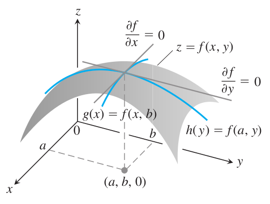

# Métodos para máximos y mínimos

<!-- <a href="https://www.lifeder.com/wp-content/uploads/2017/01/Srinivasa-Ramanujan.jpg"><div align="center"></div></a> -->


<div align="center">
<figure>
  

  <figcaption>Srinivasa Ramanujan (1887-1920).</figcaption>
</figure>
</div>


<br></br>

## Significado geométrico de máximo y mínimo local

```{r FigMaxMinA01, fig.cap="Concepto de máximo y mínimo local geometricamente [Imagen tomada de [@thomas2003thomas] pág $1028$]", fig.align='center' ,echo=FALSE, message=FALSE,  warning=FALSE, out.width = "65%"}
knitr::include_graphics("images/GrafMaxMin_A1.png")
```


<br></br>

```{definition}

Sea $f(x,y)$ definida en una región $D$ que contiene al punto $(a,b)$. Entonces

(1.) $f(a,b)$ es un valor máximo local de $f$ si $f(a,b) \geq f(x,y)$ para todos los puntos del dominio $(x,y)$ un disco abirto con centro en $(a,b)$

(2.) $f(a,b)$ es un valor mínimo local de $f$ si $f(a,b) \leq f(x,y)$ para todos los puntos del dominio $(x,y)$ un disco abirto con centro en $(a,b)$

  tomada de [@thomas2003thomas] pág $1028$
```


<br></br>


```{r FigMaxMinA02, fig.cap="Criterio para determinar  máximo y mínimo local geometricamente [Imagen tomada de [@thomas2003thomas] pág $1028$]", fig.align='center' ,echo=FALSE, message=FALSE,  warning=FALSE, out.width = "65%"}

```


<br></br>

```{theorem}
Si $f(x,y)$ tiene un valor máximo o mínimo local en un punto interior $(a,b)$ de su dominio, y si las primeras derivadas parciales existen en el punto, entonces

$$
f_{x}(a,b)=0 \qquad  \qquad \text{ y } \qquad  \qquad f_{y}(a,b)=0
$$
  
  
  tomada de [@thomas2003thomas] pág $1028$
```


<br></br>


```{definition}
Un punto interior del dominio de una función $f(x,y)$ donde $f_x$ y $f_y$ se anulan, o bien donde alguna de estas derivadas no existen, es un punto crítico de $f$


tomada de [@thomas2003thomas] pág $1029$
```

<br></br>


```{definition}
Una función diferenciable $f(x,y)$ tiene un punto silla en un punto crítico $(a,b)$ si en cada disco abierto con centro en $(a,b)$ existen punto del dominio $(x,y)$ donde $f(x,y)>f(a,b)$, y puntos del dominio $(x,y)$ donde $f(x,y)<f(a,b)$. El punto correspondiente $(a,b,f(a,b))$ sobre la superficie $z=f(x,y)$ se conoce como punto silla de la superficie. 


tomada de [@thomas2003thomas] pág $1029$
```

<br></br>

```{theorem}

Suponga que $f(x,y)$ y sus primeras y segundas derivadas parciales son continuas en un disco con centro en $(a,b)$ y que $f_{x}(a,b)=f_{y}(a,b)=0$. Entonces

(1.) $f$ tiene un máximo local en $(a,b)$, si $f_{xx}<0$ y $f_{xx}f_{yy}-\left(f_{xy}\right)^2>0$ en $(a,b)$ 

(2.) $f$ tiene un mínimo local en $(a,b)$, si $f_{xx}>0$ y $f_{xx}f_{yy}-\left(f_{xy}\right)^2>0$ en $(a,b)$ 

(3.) $f$ tiene un punto silla en $(a,b)$, si $f_{xx}f_{yy}-\left(f_{xy}\right)^2<0$ en $(a,b)$ 

(4.) El criterio no es concluyente en $(a,b)$, si $f_{xx}f_{yy}-\left(f_{xy}\right)^2=0$ en $(a,b)$. En este caso, debemos buscar otra forma de determinar el comportamiento de $f$ en $(a,b)$.


```

<br></br>

## Herramienta para obtener el Hessiano 2por2


Esta es una aplicación para obtener el valor de el Hessiano en un punto $(a,b)$ de una función $f(x,y)$, el Autor:John Jairo Estrada (https://www.geogebra.org/classic/ebw5zjfr) la elaboro usando geogebra.

<div align="center">
<meta name=viewport content="width=device-width,initial-scale=1">
<meta charset="utf-8"/>
<script src="https://www.geogebra.org/apps/deployggb.js"></script>
<div id="ggb-elementMaxMinA01"></div> 
<script>  
       var ggbAppMaxMinA01 = new GGBApplet({"material_id":"ebw5zjfr",
       "width": 800,
       "height": 600,
       "showToolBar": false,
       "showAlgebraInput": false,
       "showMenuBar": false },
       true);
       
         window.addEventListener("load", function() {  
           ggbAppMaxMinA01.inject('ggb-elementMaxMinA01');
      });
</script>
</div>


<br></br>


## Método de los multiplicadore de Lagrange para determinar máximos o mínimos


```{theorem}
Sean $f$ y $g$ funciones con primeras derivadas parciales continuas, y tales que $f$ tiene un extremo en un punto $(x_0,y_0)$ sobre la curva suave de restricción $g(x,y)=c$. Si $\nabla{g(x_0,y_0)} \neq 0$, entonces existe un número real $\lambda$ tal que

$$
\nabla{f(x_0,y_0)}=\lambda \nabla{g(x_0,y_0)}
$$
  
Tomada de [@larson2006calculo] pág $971$
```

<br></br>


Sean $f$ y $g$ funciones que satisfecen las hipótesis del teorema de Lagrange, y sea $f$ una función que tiene un mínimo o un máximo sujeto a la restircción $g(x,y)=c$. Para hallar el mínimo o el máximo de $f$, seguir los pasos descritos a continuación


(1.) Resolver simultáneamente las ecuaciones

$$
  \ \ \ \nabla{f(x,y)}=\lambda \nabla{g(x,y)} \ \qquad \ \text{ y } \ \qquad \ g(x,y)=c
$$

En otros términos resolver el sistema de ecuaciones no lineales siguiente:
  
$$
 (a) \ \ f_{x}(x,y)={\lambda}g_{x}(x,y)\\
 (b) \ \ f_{y}(x,y)={\lambda}g_{y}(x,y)\\
 (c) \ \ \ \qquad \ \ \ \ \ \ g(x,y)=c
$$
  
(2.) Evaluar $f$ en cada punto solución obtenido en el primer paso. El valor mayor da el máximo de $f$ sujeto a la restricción $g(x,y)=c$, y el valor menor da el mínimo de $f$ sujeto a la restricción $g(x,y)=c$

Tomada de [@larson2006calculo] pág $971$


<br></br>

```{example}
Hallar el valor máximo de $f(x,y)=4xy$ donde $x>0$ y $y>0$, sujeto a la restricción $x^2/9+y^2/16=1$
```

<br></br>


Sea 

$$
g(x,y)=\dfrac{x^2}{9}+\dfrac{y^2}{16}=1
$$
  
  
Igualando $\nabla{f(x,y)}=4yi+4xj$,  y  $\lambda \nabla{g(x,y)}=(2{\lambda}x/9)i+({\lambda}y/8)j$, se puede obtener el sistema de ecuaciones siguiente:
  
  

\begin{matrix} (1) & 4y=\dfrac{2x\lambda}{9} \\ (2) & 4x=\dfrac{y\lambda}{8} \\ (3) & \dfrac{x^2}{9}+\dfrac{y^2}{16}=1 \end{matrix}


De la primera ecuación, se obtiene $\lambda=18y/x$, que sustituido en la segunda ecuación da:

$$
4x=\dfrac{1}{8}\left(\dfrac{18y}{x}\right)y\\
x^2=\dfrac{9}{16}y^2
$$

Sustituyendo en la tercera ecuación $x^2$ por este valor se tiene:
  
$$
\dfrac{1}{9}\left(\dfrac{9}{16}y^2\right)+\dfrac{1}{16}y^2=1\\
y^2=8\\
y=\pm 2\sqrt(2)
$$

  
Como se requiere que $y>0$, se elige el valor positivo para $y$. Ahora se halla el valor para $x$ como:
  
  
$$
x^2=\dfrac{9}{16}y^2\\
x^2=\dfrac{9}{16}(8)=\dfrac{9}{2}\\
x=\dfrac{3}{\sqrt{2}}
$$
  
Por lo tanto, el valor máximo de $f$ es

$$
\left. f(x,y)=4xy \right]_{(3/{\sqrt{2}},2\sqrt{2})} \qquad   \Longleftrightarrow \qquad  f\left(\dfrac{3}{\sqrt{2}},2\sqrt{2}\right)=4\left(\dfrac{3}{\sqrt{2}}\right)(2\sqrt{2})=24
$$
  
Esta solución puede verse en [@larson2006calculo] pág $973$


<br></br>

```{example}
Sea $T(x,y,z)=20+2x+2y+z^2$ la temperatura en cada punto en una esfera $x^2+y^2+z^2=11$. Hallar las temperaturas extremas en la curva formada por la intersección del plano $x+y+z=3$ y la esfera.
```


<br></br>


