# Integrales simples

<!-- https://www.lifeder.com/wp-content/uploads/2016/11/Blaise-Pascal.png -->

<!-- <a href="https://www.lifeder.com/wp-content/uploads/2016/11/Blaise-Pascal.png"><div align="center"></div></a> -->


<div align="center">
<figure>
  

  <figcaption>Blaise Pascal (1623-1662).</figcaption>
</figure>
</div>

<br></br>

```{r FigIntegralSimpleA001, fig.cap="Concepto integral a partir del área bajo una curva [Imagen tomada de [@stewart2020single] pág $355$]", fig.align='center' ,echo=FALSE, message=FALSE,  warning=FALSE, out.width = "65%"}
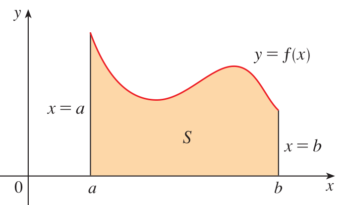
```


El cálculo integral  se base en el concepto de la integral. La definición de integral es motivada por el problema de definir y calcular el área de la región que se encuentra entre la gráfica de una funcíón $y=f(x)$ con valores positivos $f$ y el eje $x$ en un intervalo cerrado $[a,b]$.

<br></br>

```{definition}
Una antiderivada o primitiva de una función $f$ es una función $F$ tal que

$$
  F'(x)=f(x)
$$
siempre y cuando la función $f(x)$ esté bien definida.
```


<br></br>

```{theorem}
Si $F'(x)=f(x)$ en cada punto del intervalo abierto $I$, entonces cada primitiva $G$ de $f$ en $I$ tiene la forma

$$
G(x)=F(x)+C
$$

donde $C$ es una constante.

La colección de todas las primitivas de la función $f(x)$ es conocida como la integral indefinida de $f$ con respecto de $x$ y se denota por

$$
\displaystyle\int{f(x)dx}=F(x)+C
$$

donde $F(x)$ es una primitiva particular de $f(x)$. Por lo tanto se cumple que:

$$
\boxed{
\displaystyle\int{f(x)dx}=F(x)+C \qquad \text{si y sólo si } \qquad F'(x)=f(x)}
$$
```


<br></br>


<br></br>


## Primera tabla de antiderivadas 

**$$\text{ Recordar como se deriva implica saber integrar }$$**
\[
\begin{matrix}
 & D_{x}\left[F(x)+C\right]=f(x) & \Longrightarrow & \displaystyle\int{f(x)dx}=F(x)+C\\
 (1.) & D_{x}\left[x+C\right]=1 & \Longrightarrow & \displaystyle\int{1dx}=x+C\\
 (2.) & D_{x}\left[\dfrac{x^{n+1}}{n+1}+C\right]=x^n, \ \ n\neq -1 & \Longrightarrow & \displaystyle\int{x^ndx}=\dfrac{x^{n+1}}{n+1}+C, \ \ n\neq -1\\
 (3.) & D_{x}\left[e^{x}+C\right]=e^{x} & \Longrightarrow & \displaystyle\int{e^{x}dx}=e^{x}+C\\
 (4.) & D_{x}\left[\dfrac{e^{cx}}{c}+C\right]=e^{cx} & \Longrightarrow & \displaystyle\int{e^{cx}dx}=\dfrac{1}{c}e^{cx}+C\\
(5.) & D_{x}\left[sen(x)+C\right]=cos(x) & \Longrightarrow & \displaystyle\int{cos(x)dx}=sen(x)+C\\
(6.) & D_{x}\left[-cos(x)+C\right]=sen(x) & \Longrightarrow & \displaystyle\int{sen(x)dx}=-cos(x)+C\\
(7.) & D_{x}\left[tan(x)+C\right]=sec^2(x) & \Longrightarrow & \displaystyle\int{sec^2(x)dx}=tan(x)+C\\
(8.) & D_{x}\left[sec(x)+C\right]=se(x)tan(x) & \Longrightarrow & \displaystyle\int{sec(x)tan(x)dx}=sec(x)+C\\
(9.) & D_{x}\left[-csc(x)+C\right]=csc(x)cot(x) & \Longrightarrow & \displaystyle\int{csc(x)cot(x)dx}=-csc(x)+C\\
(10.) & D_{x}\left[-cot(x)+C\right]=csc^2(x) & \Longrightarrow & \displaystyle\int{csc^2(x)dx}=-cot(x)+C\\
(11.) & D_{x}\left[ln(|sec(x)|)+C\right]=tan(x) & \Longrightarrow & \displaystyle\int{tan(x)dx}=ln(|sec(x)|)+C\\
(12.) & D_{x}\left[ln(|sen(x)|)+C\right]=cot(x) & \Longrightarrow & \displaystyle\int{cot(x)dx}=ln(|sen(x)|)+C\\
(13.) & D_{x}\left[arcsen(x)+C\right]=\dfrac{1}{\sqrt{1-x^2}} & \Longrightarrow & \displaystyle\int{\dfrac{1dx}{\sqrt{1-x^2}}}=arcsen(x)+C\\
(14.) & D_{x}\left[arctan(x)+C\right]=\dfrac{1}{1+x^2} & \Longrightarrow & \displaystyle \int{\dfrac{1dx}{1+x^2}}=arctan(x)+C\\
(15.) & D_{x}\left[ln(x)+C\right]=\dfrac{1}{x} & \Longrightarrow & \displaystyle\int{x^{-1}dx}=\displaystyle\int{\dfrac{1}{x}dx}=ln(|x|)+C\\
(16.) & D_{x}\left[\dfrac{a^x}{ln(a)}+C\right]=a^{x} & \Longrightarrow & \displaystyle\int{a^{x}dx}=\dfrac{a^{x}}{ln(a)}+C\\
\end{matrix}
\]
<br></br>


## Herramienta para obtener antiderivadas

Esta es una aplicación para obtener la antiderivada de $f(x)$, el Autor:John Jairo Estrada (https://www.geogebra.org/classic/b67q6hkq) la elaboro usando geogebra.

<div align="center">
<meta name=viewport content="width=device-width,initial-scale=1">
<meta charset="utf-8"/>
<script src="https://www.geogebra.org/apps/deployggb.js"></script>
<div id="ggb-elementAntiDA01"></div> 
<script>  
       var ggbAppAntiDA01 = new GGBApplet({"material_id":"b67q6hkq",
       "width": 900,
       "height": 200,
       "showToolBar": false,
       "showAlgebraInput": false,
       "showMenuBar": false },
       true);
       
         window.addEventListener("load", function() {  
           ggbAppAntiDA01.inject('ggb-elementAntiDA01');
      });
</script>
</div>

<br></br>


## Propiedades de las antiderivadas


\begin{matrix}
(1.) & \displaystyle\int{cf(x)dx}=c\displaystyle\int{f(x)dx} \\
(2.) & \displaystyle\int{\left[f(x) \pm g(x)\right]dx}=\displaystyle\int{f(x)dx}\pm \displaystyle\int{g(x)dx} 
\end{matrix}


<br></br>

## Ejemplo1 de antiderivada

```{example}
Determinar

$$
\displaystyle\int{\left(x^4+3\sqrt{x^5}-\dfrac{4}{x^3}\right)dx}  
$$
```


```{solution}
\begin{equation} \label{eq1}
\begin{split}
\displaystyle\int{\left(x^4+3\sqrt{x^5}-\dfrac{4}{x^3}\right)dx} & = \displaystyle\int{x^4dx}+ \displaystyle\int{3\sqrt{x^5}dx}-\displaystyle\int{\dfrac{4}{x^3}dx}\\
&=\displaystyle\int{x^4dx}+ \displaystyle\int{3x^{5/2}dx}-\displaystyle\int{4{x^{-3}}dx}\\
&=\dfrac{x^{4+1}}{4+1}+3\displaystyle\int{x^{5/2}dx}-4\displaystyle\int{{x^{-3}}dx}\\
&=\dfrac{x^{4+1}}{4+1}+3\left(\dfrac{x^{5/2+1}}{5/2+1}\right)-4\left(\dfrac{x^{-3+1}}{-3+1}\right)+C\\
&=\dfrac{x^{5}}{5}+\left(\dfrac{3x^{7/2}}{7/2}\right)-4\left(\dfrac{x^{-2}}{-2}\right)+C\\
&=\dfrac{x^{5}}{5}+\left(\dfrac{6x^{7/2}}{7}\right)+2\left(\dfrac{x^{-2}}{1}\right)+C\\
&=\dfrac{x^{5}}{5}+\left(\dfrac{6}{7}\right)x^{7/2}+2\left(\dfrac{1}{x^{2}}\right)+C\\
&=\dfrac{1}{5}x^{5}+\dfrac{6}{7}\sqrt{x^{7}}+\dfrac{2}{x^{2}}+C\\
\end{split}
\end{equation}
```


<br></br>

## Ejemplo2 de antiderivada

```{example}
Determinar

$$
\displaystyle\int{(2cos(3x)+5sen(4x))dx}
$$
```


```{solution}
\begin{equation} \label{eq2}
\begin{split}

\displaystyle\int{(2cos(3x)+5sen(4x))dx} &=\displaystyle\int{2cos(3x)dx}+\displaystyle\int{5sen(4x)dx}\\
 &=2\displaystyle\int{cos(3x)dx}+5\displaystyle\int{sen(4x)dx}\\
 &=2\left(\dfrac{sen(3x)}{3}\right)+5\left(\dfrac{-cos(4x)}{4}\right)+C\\
&=\dfrac{2}{3}sen(3x)-\dfrac{5}{4}cos(4x)+C\\
\end{split}
\end{equation}
```


<br></br>

## Teorema fundamental del cálculo, caso Uno

```{theorem}

Si $f$ es continua en $[a,b]$, entonces la función $g$ definida por

$$
g(x)=\displaystyle\int_{a}^{x}f(t)dt, \qquad a \leq x \leq b
$$

es continua en $[a,b]$, derivable en $(a,b)$, y $g'(x)=f(x)$.

tomada de [@stewart2020single] pág $381$]
```

```{r FigIntegralSimpleA002, fig.cap="Grafica TMA fundamental del cálculo parte, uno [Imagen tomada de [@stewart2020single] pág $380$]", fig.align='center' ,echo=FALSE, message=FALSE,  warning=FALSE, out.width = "65%"}
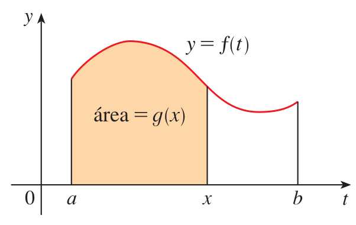
```


<br></br>

```{example}
Encuentre

$$
  \dfrac{d}{dx}\left[\displaystyle\int_{a}^{x^4}sec(t)dt\right]
$$

```


<br></br>

En este caso debe ser cuidadoso al usar la regla de la cadena junto con TFC1. Sea $u=x^4$. Por lo tanto

\begin{equation} \label{eqdSS0}
\begin{split} 
\dfrac{d}{dx}\left[\displaystyle\int_{a}^{x^4}sec(t)dt\right] & = \dfrac{d}{dx}\left[\displaystyle\int_{a}^{u}sec(t)dt\right]\\
& = \dfrac{d}{du}\left[\displaystyle\int_{a}^{u}sec(t)dt\right]\dfrac{du}{dx}\\
& = sec(u)\dfrac{du}{dx}\\
& = sec(x^4).4x^3
\end{split}
\end{equation}

tomada de [@stewart2020single] pág 384


<br></br>

## Teorema fundamental del cálculo, caso Dos

```{theorem}
Si $f$ es continua en $[a,b]$, entonces

$$
\int_{a}^{b}{f(x)dx}=F(b)-F(a)
$$
  
donde $F$ es la antiderivada de $f$, es decir, una función tal que $F'=f$.

tomada de [@stewart2020single] pág $384$] 
```


<br></br>


<br></br>

## Técnicas de integración


## Integración por sustitución o cambio de variable

En general la técnica de sustitución funciona siempre que se tiene una integral que se pueda escribir en la forma:

\[
\boxed{
\displaystyle\int{f(g(x))g'(x)dx}}
\]


Si $u=g(x)$ es una función derivable cuyo alcance es un intervalo $I$, y $f$ es continua sobre $I$, entonces

$$
  \displaystyle\int{f(g(x))g'(x)dx}=\displaystyle\int{f(u)du}
$$


<br></br>

### Ejemplo1 por sustitución


```{example}
Encuentre 

$$
\displaystyle\int{2x\sqrt{1+x^2}dx} 
$$
```

<br></br>


Tomando el cambio de variable $\boxed{w^2=1+x^2}$ (1), se genera que $2wdw=2xdx$; simplificando por $2$ en ambos lados de la igualdad se obtiene que $\boxed{wdw=xdx}$ (2).
Realizando la sustitución de (1) y (2). Se obtiene que:
  
  
\begin{equation} \label{eqdSS1}
\begin{split}  
I & =\displaystyle\int{2x\sqrt{1+x^2}dx} =2\displaystyle\int{x\sqrt{1+x^2}dx}=2\displaystyle\int{\sqrt{1+x^2}xdx}\\
I & =2\displaystyle\int{\sqrt{w^2}wdw}2\displaystyle\int{wwdw}=2\displaystyle\int{w^2dw}\\
I & =2\left(\dfrac{w^3}{3}\right)+C\\
I & =\left(\dfrac{2}{3}\right)w^3+C
\end{split}
\end{equation}


Respuesta en la variable $x$:
  
  
\[
  \displaystyle\int{2x\sqrt{1+x^2}dx}  = \left(\dfrac{2}{3}\right)\left(\sqrt{1+x^2}\right)^{3}+C
\]


<br></br>

### Ejemplo2 por sustitución


```{example}
Encuentre 

$$
\displaystyle\int{\sqrt{2x+1}dx} 
$$
```

<br></br>


Tomaremos el cambio $\boxed{w^2=2x+1}$ (1), entonces $2wdw=2dx$, simplificando en ambos lados de la igualdad por $2$, se obtiene que: $\boxed{wdw=dx}$ (2).

Realizando la sustitución de (1), y (2) en la integral obtenemos:
  
\begin{equation} \label{eqdSS2}
\begin{split} 
I & = \displaystyle\int{\sqrt{2x+1}dx} \qquad \longleftrightarrow  \quad \displaystyle\int{\sqrt{w^2}w}dw=  \displaystyle\int{w.wdw}=  \displaystyle\int{w^2dw} = \dfrac{w^3}{3}+C\\

\end{split}
\end{equation}


Respuesta en la variable $x$:
  
  
\[
  \displaystyle\int{\sqrt{2x+1}dx}   = \dfrac{1}{3}\left(\sqrt{2x+1}\right)^{3}+C
\]


<br></br>

### Ejemplo3 por sustitución


```{example}
Encuentre 

$$
\displaystyle\int{x^3cos(x^4+2)dx} 
$$
```


Tomaremos el cambio $\boxed{w=x^4+2}$ (1), entonces $dw=4x^3dx$, simplificando en ambos lados de la igualdad por $4$, se obtiene que: $\boxed{dw/4=x^3dx}$ (2).

Realizando la sustitución de (1), y (2) en la integral obtenemos:
  
\begin{equation} \label{eqdSS3}
\begin{split} 

I = \displaystyle\int{x^3cos(x^4+2)dx} =\displaystyle\int{cos(x^4+2)x^3dx} \ \longleftrightarrow  \ \displaystyle\int{cos(w)\dfrac{dw}{4}} & =  \dfrac{1}{4}\displaystyle\int{cos(w)dw}=\\
& = \dfrac{sen(w)}{4}+C\\

\end{split}
\end{equation}


Respuesta en la variable $x$:
  
  
\[
 \displaystyle\int{x^3cos(x^4+2)dx}   = \dfrac{sen(x^4+2)}{4}+C
\]


<br></br>

### Ejemplo4 por sustitución


```{example}
Encuentre 

$$
\displaystyle\int{x^5\sqrt{x^2+1}dx} 
$$
```


Tomaremos el cambio $\boxed{w^2=x^2+1}$ (1), entonces $2wdw=2xdx$, simplificando en ambos lados de la igualdad por $2$, se obtiene que: $\boxed{wdw=xdx}$ (2). Además $\boxed{w^2-1=x^2}$ (3).

Realizando la sustitución de (1), (2), y (3) en la integral obtenemos:
  
\begin{equation} \label{eqdSS4}
\begin{split} 
I & = \displaystyle\int{x^5\sqrt{x^2+1}dx} =\displaystyle\int{\left(x^2\right)^2\left(\sqrt{x^2+1}\right)xdx}\\

& \longleftrightarrow  \ \displaystyle\int{(w^2-1)^2\sqrt{w^2}.wdw}\\
& = \displaystyle\int{(w^2-1)^2w.wdw}=\displaystyle\int{(w^2-1)^2.w^2}dw\\
& = \displaystyle\int{\left(\left(w^2\right)^2-2w^2+1\right).w^2dw}\\
& = \displaystyle\int{\left(w^4-2w^2+1\right).w^2dw}=\displaystyle\int{\left(w^6-2w^4+w^2\right).dw}\\
& =\dfrac{w^7}{7}-\dfrac{2w^5}{5}+\dfrac{w^3}{3}+C

\end{split}
\end{equation}


Como sabemos que $w^2=x^2+1$, entonces $w=\sqrt{x^2+1}=\left(x^2+1\right)^{1/2}$. Y por tal motivo la respuesta en la variable $x$ es:
  
  
\[
 \displaystyle\int{x^5\sqrt{x^2+1}dx}    = \dfrac{\left(x^2+1\right)^{7/2}}{7}-\dfrac{2\left(x^2+1\right)^{5/2}}{5}+\dfrac{\left(x^2+1\right)^{3/2}}{3}+C
\]


<br></br>

## Integración por partes


$$
\boxed{
\displaystyle\int{f(x)g'(x)dx}=f(x)g(x)- \displaystyle\int{g(x)f'(x)dx}}
$$

Una representación equivalente será haciendo el cambio de variable:


$u=f(x)$, $v=g(x)$, entonces $du=f'(x)dx$, y $dv=g'(x)dx$

$$
\boxed{
\displaystyle\int{udv}=uv- \displaystyle\int{vdu}}
$$


<br></br>

### Ejemplo1 por partes


```{example}
Encuentre 

$$
\displaystyle\int{xsen(x)dx} 
$$
```


<br></br>


Sabemos que $D_{x}\left[-cos(x)\right]=sen(x)$, ó  equivalentemente

$$
  \dfrac{d}{dx}\left[-cos(x)\right]=sen(x)   \qquad  \text{ ó  equivalentemente } \qquad d\left[-cos(x)\right]=sen(x)dx
$$
  
Entonces

\begin{equation} \label{eqdpp1}
\begin{split}
\displaystyle\int{xsen(x)dx} &=  \displaystyle\int{xd\left[-cos(x)\right]}=-xcos(x)-\displaystyle\int{-cos(x)d[x]}\\
&=-xcos(x)+\displaystyle\int{cos(x)dx} \qquad \text{Recordar: } \quad d[x]=1dx=dx  \qquad \\
& = -xcos(x)+sen(x)+C
\end{split}
\end{equation}

Respuesta:
  
  
\[
  \displaystyle\int{xsen(x)dx} = -xcos(x)+sen(x)+C
\]


<br></br>

### Ejemplo2 por partes


```{example}
Encuentre 

$$
\displaystyle\int{xe^{x}dx} 
$$
```

<br></br>


Para realizar la integración por partes lo haremos usando la fórmula:
$$
\boxed{
\displaystyle\int{udv}=uv- \displaystyle\int{vdu}}
$$
  
Aquí tomaremos $u=x$ y $dv=e^{x}dx$
  
Sabemos que:
  
$$
\text{Como } \qquad dv=e^{x}dx \qquad \qquad \text{ entonces } \qquad  v=\displaystyle\int{e^{x}dx}=e^{x}  \qquad \text{ aquí la constante es } \ C=0.
$$
Por lo tanto


\begin{equation} \label{eqdpp2}
\begin{split}
\displaystyle\int{udv} &= uv- \displaystyle\int{vdu} \\
& = xe^{x}-\displaystyle\int{e^{x}dx}  \qquad \qquad  \text{ a quí }  \quad du=1dx\\
& = xe^{x}-e^{x}+C
\end{split}
\end{equation}


Respuesta:
  
  
\[
  \displaystyle\int{xe^{x}dx} = xe^{x}-e^{x}+C
\]


<br></br>


### Ejemplo3 por partes


```{example}
Encuentre 

$$
\displaystyle\int{x^2e^{x}dx} 
$$
```

<br></br>


En el proceso de solución vamos a usar parte de la notación de antiderivada

Sabemos que 

$$
  D_{x}\left[e^{x}\right]=e^{x} \qquad \text{ es equivalente a } \qquad D\left[e^{x}\right]=e^{x}dx
$$  
Aplicando esta notación a la integral propuesta tenemos:
  
\begin{equation} \label{eqdpp3}
\begin{split}
\displaystyle\int{x^2e^{x}dx} &=\displaystyle\int{x^2D\left[e^{x}\right]}\\
& =x^2e^{x}-\displaystyle\int{e^{x}D\left[x^2\right]}\\
& =x^2e^{x}-2\displaystyle\int{xe^{x}dx}\\
& =x^2e^{x}-2\left[\displaystyle\int{xD\left[e^{x}\right]}\right]\\
& =x^2e^{x}-2\left[xe^{x}-\displaystyle\int{e^{x}D\left[x\right]}\right]\\
& =x^2e^{x}-2\left[xe^{x}-\displaystyle\int{e^{x}dx}\right]\\
& =x^2e^{x}-2\left[xe^{x}-e^{x}\right]+C\\
& =x^2e^{x}-2xe^{x}+2e^{x}+C\\
& =e^{x}\left(x^2-2x+2\right)+C
\end{split}
\end{equation}


Respuesta:
  
  
\[
  \displaystyle\int{x^2e^{x}dx} = e^{x}\left(x^2-2x+2\right)+C
\]


<br></br>

### Ejemplo4 por partes


```{example}
Encuentre 

$$
\displaystyle\int{(ax^2+bx+c)e^{x}dx} 
$$
donde $a$, $b$, y $c$ son constantes
```


<br></br>


\begin{equation} \label{eqdpp4}
\begin{split}
\displaystyle\int{(ax^2+bx+c)e^{x}dx} & =  a\displaystyle\int{x^2e^{x}dx}+b\displaystyle\int{xe^{x}dx}+c\displaystyle\int{e^{x}dx}\\
& =ae^{x}\left[x^2-2x+2\right]+be^{x}\left[x-1\right]+ce^{x}+C\\
& =e^{x}\left(a\left[x^2-2x+2\right]+b\left[x-1\right]+c\right)+C\\
& =e^{x}\left[ax^2+(b-2a)x+(2a-1b+c)\right]+C\\

\end{split}
\end{equation}


Respuesta:
  
  
\[
  \displaystyle\int{(ax^2+bx+c)e^{x}dx} = e^{x}\left[ax^2+(b-2a)x+(2a-1b+c)\right]+C
\]


<br></br>

### Ejemplo5 por partes


```{example}
Encuentre 

$$
\displaystyle\int{sen(x)e^{x}dx} 
$$
```

<br></br>


\begin{equation} \label{eqdpp5}
\begin{split}
I_{1} & =\displaystyle\int{sen(x)e^{x}dx}  = \\
& =\displaystyle\int{sen(x)D\left[e^{x}\right]}\\
& = sen(x)e^{x}-\displaystyle\int{e^{x}D\left[sen(x)\right]}\\
& = sen(x)e^{x}-\displaystyle\int{e^{x}cos(x)dx}\\
& = sen(x)e^{x}-\displaystyle\int{cos(x)D\left[e^{x}\right]}\\
& = sen(x)e^{x}-\left(cos(x)e^{x}-\displaystyle\int{e^{x}D\left[cos(x)\right]}\right)\\
& = sen(x)e^{x}-cos(x)e^{x}+\displaystyle\int{e^{x}D\left[cos(x)\right]}\\
& = sen(x)e^{x}-cos(x)e^{x}-\displaystyle\int{sen(x)e^{x}dx}\\
I_{1} & = sen(x)e^{x}-cos(x)e^{x}-I_{1}\\
2I_{1} & =e^{x}\left[sen(x)-cos(x)\right]+C_{1}\\
I_{1} & = \dfrac{e^{x}}{2}\left[sen(x)-cos(x)\right]+\dfrac{C_{1}}{2}\\
I_{1} & = \dfrac{e^{x}}{2}\left[sen(x)-cos(x)\right]+C\\
\end{split}
\end{equation}


Respuesta:
  
  
\[
  \displaystyle\int{sen(x)e^{x}dx}  = \dfrac{e^{x}}{2}\left[sen(x)-cos(x)\right]+C\\
\]


<br></br>

### Ejemplo6 por partes

```{example}
Encuentre 

$$
\displaystyle\int{arcsen(x)dx} 
$$
```


<br></br>


\begin{equation} \label{eqdpp6}
\begin{split}
I & =\displaystyle\int{arcsen(x)dx}  = \displaystyle\int{arcsen(x)1dx} \\
& = \displaystyle\int{arcsen(x)D\left[x\right]} \\
& = xarcsen(x)-\displaystyle\int{xD\left[arcsen(x)\right]} \\
& = xarcsen(x)-\displaystyle\int{x\left(\dfrac{dx}{\sqrt{1-x^2}}\right)} \\
& = xarcsen(x)-\displaystyle\int{\dfrac{xdx}{\sqrt{1-x^2}}} \\
& \text{Realizando el cambio } \quad \boxed{w^2=1-x^2} \ \ (1) \quad \text{ implica que } \quad 2wdw=-2xdx \\
& \text{Entonces } \quad \boxed{-wdw=xdx} \ \ (2) \\
& \text{Usando (1) y (2) en } \quad \displaystyle\int{\dfrac{xdx}{\sqrt{1-x^2}}} \quad   \longleftrightarrow  \quad \displaystyle\int{\dfrac{-wdw}{\sqrt{w^2}}} =-\displaystyle\int{\dfrac{wdw}{w}}=-\displaystyle\int{dw}=-w+C\\

I & = xarcsen(x)-\left(-\sqrt{1-x^2}\right)+C\\

I & = xarcsen(x)+\sqrt{1-x^2}+C

\end{split}
\end{equation}

Respuesta:
  
  
\[
  \displaystyle\int{arcsen(x)dx}  = xarcsen(x)+\sqrt{1-x^2}+C\\
\]


## Integración por sustitución trigonométrica


\[
\boxed{
\begin{matrix}
\text{Expresión} & \text{Sustitución}&\text{Cond para }\theta & \text{Identidad}\\
\sqrt{a^2-x^2}; & x=asen(\theta); & -\dfrac{\pi}{2} \leq \theta \leq \dfrac{\pi}{2}; & 1-sen^2(\theta)=cos^2(\theta)\\
 \end{matrix}}
\]


### Ejemplo1

```{example}
Determine

$$
\displaystyle{\int{\dfrac{\sqrt{9-x^2}}{x^2}dx}}
$$

```


<br></br>

Primero:
  
Asumir que $a^2=9$, entonces $a=3$ y $x=asen(\theta)$ es equivalente a $x=3sen(\theta)$ (1).
$dx=3cos(\theta)d\theta$ (2).

Segundo:
  
Sustituir (1)y(2) en la integral, así:

\begin{equation} \label{eqST1}
\begin{split}
I & =\displaystyle{\int{\dfrac{\sqrt{9-\left(3sen(\theta)\right)^2}}{\left(3sen(\theta)\right)^2}3cos(\theta)d\theta}}\\
& = \displaystyle{\int{\dfrac{\sqrt{9-\left(9sen^2(\theta)\right)}}{9sen^2(\theta)}3cos(\theta)d\theta}}\\
& = \displaystyle{\int{\dfrac{\sqrt{9\left(1-sen^2(\theta)\right)}}{9sen^2(\theta)}3cos(\theta)d\theta}}\\
& = \displaystyle{\int{\dfrac{\sqrt{9\left(cos(\theta)\right)^2}}{9sen^2(\theta)}3cos(\theta)d\theta}}\\
& = \displaystyle{\int{\dfrac{3cos(\theta)}{9sen^2(\theta)}3cos(\theta)d\theta}}\\
& = \displaystyle{\int{\dfrac{9cos^2(\theta)}{9sen^2(\theta)}d\theta}}\\
& = \displaystyle{\int{\dfrac{cos^2(\theta)}{sen^2(\theta)}d\theta}}\\
& = \displaystyle{\int{\dfrac{1-sen^2(\theta)}{sen^2(\theta)}d\theta}}\\
& = \displaystyle{\int{\left[\dfrac{1}{sen^2(\theta)}-\dfrac{sen^2(\theta)}{sen^2(\theta)}\right]d\theta}}\\
& = \displaystyle{\int{\left[csc^2(\theta)-1\right]d\theta}}=\displaystyle{\int{csc^2(\theta)d\theta}}-\displaystyle{\int{1d\theta}}\\
& = -cot(\theta)- \theta +C
\end{split}
\end{equation}


```{r FigSustitucionTG1, fig.cap="Triángulo rectángulo para la sustitución trigonométrica uno [Imagen tomada de [@stewart2009calculus] pág $468$]", fig.align='center' ,echo=FALSE, message=FALSE,  warning=FALSE, out.width = "35%"}
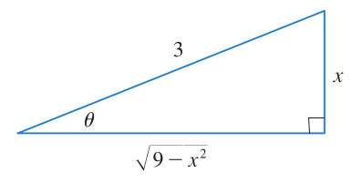
```


Respuesta:

(1.) Del triángulo rectángulo es claro que  $sen(\theta)=\dfrac{x}{3}$, entonces $\theta=sen^{-1}\left(\dfrac{x}{3}\right)$


(2.) Del triángulo rectángulo es claro que $cot(\theta)=\dfrac{\sqrt{9-x^2}}{x}$

\[
\displaystyle{\int{\dfrac{\sqrt{9-x^2}}{x^2}dx}}=-\dfrac{\sqrt{9-x^2}}{x}-sen^{-1}\left(\dfrac{x}{3}\right)+C
\]

<br></br>


\[
\boxed{
\begin{matrix}
\text{Expresión} & \text{Sustitución}&\text{Cond para }\theta & \text{Identidad}\\
\sqrt{a^2+x^2}; & x=atan(\theta); & -\dfrac{\pi}{2} < \theta < \dfrac{\pi}{2}; & 1+tan^2(\theta)=sec^2(\theta)\\
 \end{matrix}}
\]


### Ejemplo2

```{example}
Determine

$$
\displaystyle{\int{\dfrac{1}{x^2\sqrt{x^2+4}}dx}}
$$

```


Primero:
  
Asumir que $a^2=4$, entonces $a=2$ y $x=atan(\theta)$ es equivalente a $x=2tan(\theta)$ (1).
$dx=2sec^2(\theta)d\theta$ (2).

Segundo:
  
Sustituir (1)y(2) en la integral, así:

\begin{equation} \label{eqST2}
\begin{split}

I & = \displaystyle{\int{\dfrac{2sec^2(\theta)d\theta}{4tan^2(\theta)\sqrt{4tan^2(\theta)+4}}}}\\
& = \displaystyle{\int{\dfrac{2sec^2(\theta)d\theta}{4tan^2(\theta)\sqrt{4\left(tan^2(\theta)+1\right)}}}}\\
& = \displaystyle{\int{\dfrac{2sec^2(\theta)d\theta}{4tan^2(\theta)\sqrt{4sec^2(\theta)}}}}\\
& = \displaystyle{\int{\dfrac{2sec^2(\theta)d\theta}{4tan^2(\theta)2sec(\theta)}}}\\
& = \displaystyle{\int{\dfrac{sec(\theta)d\theta}{4tan^2(\theta)}}}\\
& = \displaystyle{\int{\dfrac{sec(\theta)d\theta}{4tan^2(\theta)}}}; \  \ \ \text{Sabemos que: } \qquad  \dfrac{sec(\theta)}{tan^2(\theta)}=\dfrac{1}{cos(\theta)}.\dfrac{cos^2(\theta)}{sen^2(\theta)}=\dfrac{cos(\theta)}{sen^2(\theta)}\\
& = \displaystyle{\int{\dfrac{sec(\theta)d\theta}{4tan^2(\theta)}}}= \displaystyle{\int{\dfrac{cos(\theta)d\theta}{4sen^2(\theta)}}}\\
& = \dfrac{1}{4}\displaystyle{\int{\dfrac{cos(\theta)d\theta}{sen^2(\theta)}}}\quad \text{Realizando el cambio }  u=sen(\theta), \ \  \text{entonces } \ \ du=cos(\theta)d\theta\\
&  \qquad \longleftrightarrow \dfrac{1}{4}\displaystyle{\int{\dfrac{du}{u^2}}}=\dfrac{1}{4}\displaystyle{\int{u^{-2}du}}=\dfrac{-1}{4u}+C\\
\end{split}
\end{equation}


Respuesta en la variable $\theta$:
  
  
\[
  \dfrac{1}{4}\displaystyle{\int{\dfrac{cos(\theta)d\theta}{sen^2(\theta)}}}  = -\dfrac{1}{4sen(\theta)}+C=\dfrac{-csc(\theta)}{4}+C\\
\]


```{r FigSustitucionTG2, fig.cap="Triángulo rectángulo para la sustitución trigonométrica dos [Imagen tomada de [@stewart2009calculus] pág $469$]", fig.align='center' ,echo=FALSE, message=FALSE,  warning=FALSE, out.width = "35%"}
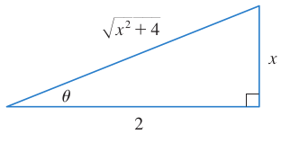
```


Respuesta en la variable $x$:

Del triángulo rectángulo es claro que  $csc(\theta)=\dfrac{\sqrt{x^2+4}}{x}$, entonces 

\[
\displaystyle{\int{\dfrac{1}{x^2\sqrt{x^2+4}}dx}}=-\dfrac{\sqrt{x^2+4}}{4x}+C
\]


<br></br>

<br></br>


\[
\boxed{
\begin{matrix}
\text{Expresión} & \text{Sustitución}&\text{Cond para }\theta & \text{Identidad}\\
\sqrt{x^2-a^2}; & x=asec(\theta); & 0 \leq \theta < \dfrac{\pi}{2} \text{ ó } \pi \leq \theta < \dfrac{3\pi}{2}; & sec^2(\theta)-1=tan^2(\theta)\\
 \end{matrix}}
\]


### Ejemplo3

```{example}
Determine

$$
\displaystyle{\int{\dfrac{1}{\sqrt{x^2-4}}dx}}
$$

```


<br></br>


Primero:
  
Asumir que $a^2=4$, entonces $a=2$ y $x=asec(\theta)$ es equivalente a $x=2sec(\theta)$ (1).
$dx=2sec(\theta)tan(\theta)d\theta$ (2).

Segundo:
  
Sustituir (1)y(2) en la integral, así:

\begin{equation} \label{eqST3}
\begin{split}
I & =\displaystyle{\int{\dfrac{1}{\sqrt{\left(4sec^2(\theta)-4\right)}}2sec(\theta)tan(\theta)d\theta}}\\
& =\displaystyle{\int{\dfrac{1}{\sqrt{4(sec^2(\theta)-1)}}2sec(\theta)tan(\theta)d\theta}}\\
& =\displaystyle{\int{\dfrac{1}{\sqrt{4tan^2(\theta)}}2sec(\theta)tan(\theta)d\theta}}\\
& =\displaystyle{\int{\dfrac{1}{2tan(\theta)}2sec(\theta)tan(\theta)d\theta}}\\
& =\displaystyle{\int{sec(\theta)d\theta}}=ln|sec(\theta)+tan(\theta)|+C\\

\end{split}
\end{equation}


```{r FigSustitucionTG3, fig.cap="Triángulo rectángulo para la sustitución trigonométrica tres [Imagen tomada de [@stewart2009calculus] pág $469$]", fig.align='center' ,echo=FALSE, message=FALSE,  warning=FALSE, out.width = "35%"}
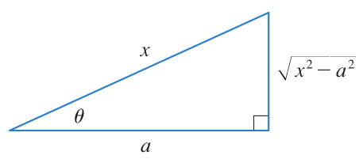
```

Respuesta en la variable $x$:

(1.) Del triángulo rectángulo es claro que si $a=2$, entonces  $tan(\theta)=\dfrac{\sqrt{x^2-4}}{2}$.


(2.) Del triángulo rectángulo es claro que si $a=2$, entonces $sec(\theta)=\dfrac{x}{2}$.


\[
\displaystyle{\int{\dfrac{1}{\sqrt{x^2-4}}dx}}=ln\left|\dfrac{x}{2}+\dfrac{\sqrt{x^2-4}}{2}\right|+C
\]

<br></br>

## Integación por fracciones parciales

```{definition}
Una fracción racional se dice fracción propia, si y sólo si el grado del numerador es menor que el grado del denominador, donde tanto el numerador como el denominador no tienen factores comunes.

$$
  f(x)=\dfrac{P(x)}{Q(x)}, \qquad \text{ es fracción propia si y sólo si } \qquad grado(P) < grado(Q)
$$

  
  
Una fracción se dice impropia si no es propia. Más aún:
  
$$
  f(x)=\dfrac{P(x)}{Q(x)}, \qquad \text{ es fracción impropia si y sólo si } \qquad grado(P) \geq grado(Q)
$$
  
NOTA: Si $f(x)$ es una fracción racional impropia entonces es posible descomponer $f(x)$ como:
  
$$
  f(x)=\dfrac{P(x)}{Q(x)}=S(x)+\dfrac{R(x)}{Q(x)}, \qquad \text{ tal que } \qquad grado(R) < grado(Q)
$$
```

<br></br>

### Ejemplo1

```{example}
Determinar
  
$$
\displaystyle\int{\dfrac{x^3+x}{x-1}dx} 
$$
tomada de [@stewart2020single] pág $474$.
```


<br></br>


Realizando la división de ambos polinomios se obtiene que:
  
\[
\dfrac{x^3+x}{x-1}=x^2+x+2+\dfrac{2}{x-1}
\]  
Entonces

\begin{equation} \label{eqFP1}
\begin{split}
\displaystyle\int{\dfrac{x^3+x}{x-1}dx} & = \displaystyle\int{x^2dx}+\displaystyle\int{xdx}+\displaystyle\int{2dx}+\displaystyle\int{\dfrac{2}{x-1}dx}\\
& = \dfrac{x^3}{3}+\dfrac{x^2}{2}+2x+2ln|x-1|+C
\end{split}
\end{equation}


<br></br>


### Ejemplo2


**El denominador $Q(x)$ es un producto de factores lineales distintos**

\[
Q(x)=(a_1x+b_1)(a_2x+b_2)...(a_kx+b_k)
\]

donde ningún factor se repite. Entonces por teorema de facciones parciales existen constantes $A_1,A_2,...,A_k$, tales que

\[
f(x)=\dfrac{P(x)}{Q(x)}=\dfrac{A_1}{a_1x+b_1}+\dfrac{A_2}{a_2x+b_2}+...+\dfrac{A_k}{a_kx+b_k}, \ \ \ \text{ donde } \ \ \ grado(P(x))<grado(Q(x))
\]


```{example}
Determine

$$
\displaystyle\int{\dfrac{1x^2+2x-1}{2x^3+3x^2-2x}dx} 
$$
  tomada de [@stewart2020single] pág $475$
```


<br></br>


Sabemos que por factorización el denominador $Q(x)$ puede ser expresado equivalentemente como:

  
\[
Q(x)  =2x^3+3x^2-2x=x(2x^2+3x-2)=x(2x-1)(x+2)
\]

Por lo tanto

\[
\dfrac{1x^2+2x-1}{2x^3+3x^2-2x}=\dfrac{1x^2+2x-1}{x(2x-1)(x+2)}=\dfrac{A}{x}+\dfrac{B}{2x-1}+\dfrac{C}{x+2} \ \ \ (a)
\]

Para determinar los valores correspondientes a $A$, $B$, y $C$ multiplicamos al ecuación (a) por $x(2x-1)(x+2)$ en ambos lados el la igualdad
de lo cual obtenemos:
  
  
\[
1x^2+2x-1= A(2x-1)(x+2)+Bx(x+2)+Cx(2x-1)  \ \ \ (b)
\]

Al desarrollar el lado izquierdo de (b) y reagrupar términos, se obtiene:
  
\[
1x^2+2x-1= (2A+B+2C)x^2+(3A+2B-C)x-2A  \ \ \ (c)
\] 

Aplicando la definición de polinomios iguales, recordemos que dos polinomios son iguales, si y sólo si poseen el mismo grado y sus coeficientes correspondientes son iguales, entonces aplicando esto a la igualdad de polinomios expresada en (c), se obtiene el sistema $3\times 3$:
  
  


\[
\begin{matrix} 2A +B+2C & = & 1\\
3A +2B-C & = & 2\\
-2A  & = & -1\\ \end{matrix}
\]

Usando cualquier técnica para obtener la solución del sistema $3\times 3$, se llega a los resultados:

\[
A=\dfrac{1}{2}, \qquad B=\dfrac{1}{5}, \qquad C=\dfrac{-1}{10}
\]

Por lo tanto

\[
\begin{equation} \label{eqFP2}
\begin{split}
\displaystyle\int{\dfrac{1x^2+2x-1}{2x^3+3x^2-2x}dx} & = \displaystyle\int{\left[\dfrac{1}{2}\dfrac{1}{x}+\dfrac{1}{5}\dfrac{1}{2x-1}-\dfrac{1}{10}\dfrac{1}{x+2}\right]dx}\\
& = \displaystyle\int{\dfrac{1}{2}\dfrac{1}{x}dx}+\displaystyle\int{\dfrac{1}{5}\dfrac{1}{2x-1}dx}-\displaystyle\int{\dfrac{1}{10}\dfrac{1}{x+2}dx}\\
& = \dfrac{1}{2}\displaystyle\int{\dfrac{1}{x}dx}+\dfrac{1}{5}\displaystyle\int{\dfrac{1}{2x-1}dx}-\dfrac{1}{10}\displaystyle\int{\dfrac{1}{x+2}dx}\\
& = \dfrac{1}{2}ln|x|+\dfrac{1}{5}ln|2x-1|-\dfrac{1}{10}ln|x+2|+C
\end{split}
\end{equation}
\]

Respuesta en la variable $x$:


$$
\displaystyle\int{\dfrac{1x^2+2x-1}{2x^3+3x^2-2x}dx}=\dfrac{1}{2}ln|x|+\dfrac{1}{5}ln|2x-1|-\dfrac{1}{10}ln|x+2|+C
$$


<br></br>

### Ejemplo3


**El denominador $Q(x)$ es un producto de factores lineales, algunos de los cuales se repiten**

\[
Q(x)=(a_1x+b_1)^r(a_2x+b_2)^s...(a_kx+b_k)^t
\]

Entonces por teorema de facciones parciales existen constantes $A_1,A_2,...,A_r$, tales que para el factor $(a_1x+b_1)^r$, se tiene:

\[
\dfrac{A_1}{a_1x+b_1}+\dfrac{A_2}{(a_1x+b_1)^2}+...+\dfrac{A_r}{(a_1x+b_1)^r}, \ \ \ \text{ donde } \ \ \ r\geq 2
\]


```{example}
Determinar

\[
\displaystyle\int{\dfrac{x^4-2x^2+4x+1}{x^3-x^2-x+1}dx}
\]

tomada de [@stewart2020single] pág $477$
```


<br></br>


Primero debe verse que $grado(P(x))\geq grado(Q(x))$, lo que significa que se debe realizar la división entre ambos polinomios, obteniendo:
  
\[
  \dfrac{x^4-2x^2+4x+1}{x^3-x^2-x+1}=x+1+\dfrac{4x}{x^3-x^2-x+1}
\]

Además por factorización se puede ver que $Q(x)$ puede expresarse como:
  
$$
Q(x)=x^3-x^2-x+1=(x-1)^2(x+1)
$$
  
Si la descomposición para la fracción propia con factor lineal repetido tiene la forma:

\[
\dfrac{4x}{(x-1)^2(x+1)}=\dfrac{A}{x-1}+\dfrac{B}{(x-1)^2}+\dfrac{C}{x+1}   \ \ \ (1).
\] 
  
  
Entonces el enunciado queda representado como:
  
\[
\begin{equation} \label{eqFP3}
\begin{split}
I & =\displaystyle\int{\dfrac{x^4-2x^2+4x+1}{x^3-x^2-x+1}dx}\\ 
& =\displaystyle\int{\left[x+1+\dfrac{4x}{(x-1)^2(x+1)}\right]dx}\\
& =\displaystyle\int{\left[x+1+A\left(\dfrac{1}{x-1}\right)+B\left(\dfrac{1}{(x-1)^2}\right)+C\left(\dfrac{1}{x+1}\right)\right]dx}\\
& =\displaystyle\int{(x+1)dx}+A\displaystyle\int{\dfrac{1}{x-1}dx}+B\displaystyle\int{\dfrac{1}{(x-1)^2}dx}+C\displaystyle\int{\dfrac{1}{x+1}dx}\\
\end{split}
\end{equation}
\] 

Para determinar los valores de $A$, $B$, y $C$, se procede de la igualdad (1), multiplicando por $(x-1)^2(x+1)$ en ambos lados de la ecuación (1), se obtiene:
  
  
\[
0x^2+4x+0=A(x-1)(x+1)+B(x+1)+c(x-1)^2 \ \ \ (2).  
\]

Desarrollando el lado izquierdo de (2), y reagrupando se tiene:
  
\[
0x^2+4x+0=(A+C)x^2+(B-2C)x+(B+C-A)  \ \ \ (3). 
\]  

Como ambos polinomios en (3) son de igual grado, entonces podemos igualar coeficiente a coeficiente, asi:


\[
\begin{matrix} 
A + C & = & 0\\
B - 2C & = & 4\\
-A + B + C & = & 0\\ \end{matrix}
\]


Usando cualquier técnica para obtener la solución del sistema $3\times 3$, se llega a los resultados:

\[
A=1, \qquad B=2, \qquad C=-1
\]

Por lo tanto

\[
\begin{equation} \label{eqFP4}
\begin{split}
\displaystyle\int{\dfrac{x^4-2x^2+4x+1}{x^3-x^2-x+1}dx} & = \displaystyle\int{(x+1)dx}+1\displaystyle\int{\dfrac{1}{x-1}dx}+2\displaystyle\int{\dfrac{1}{(x-1)^2}dx}+-1\displaystyle\int{\dfrac{1}{x+1}dx}\\
& =\dfrac{x^2}{2}+1x+ln|x-1|-\dfrac{2}{x-1}-ln|x+1|+C
\end{split}
\end{equation}
\]

<br></br>

### Ejemplo4

**El denominador $Q(x)$ contiene factores cuadráticos irreducibles, ninguno de los cuales se repite**

Una expresión cuadrática de la forma $ax^2+bx+c$ se dice irreducible en el conjunto de los número reales, si $D=b^2-4ac<0$


```{example}
Determinar

\[
\displaystyle\int{\dfrac{x^2-x+4}{x^3+4x}dx}
\]

tomada de [@stewart2020single] pág $478$
```


<br></br>


Como el denominador $Q(x)=x^3+4x$, se puede factorizar en la forma: $Q(x)=x(x^2+4)$ donde $x^2+4$ es una expresión cuadrática irreducible. Entonces

\[
\dfrac{x^2-x+4}{x^3+4x}=\dfrac{x^2-x+4}{x(x^2+4)} =\dfrac{A}{x}+\dfrac{Bx+C}{x^2+4} \ \ \ (1)
\]

de donde

\[
\begin{equation} \label{eqFP5}
\begin{split}
\displaystyle\int{\dfrac{x^2-x+4}{x^3+4x}dx} & =\displaystyle\int{\dfrac{A}{x}dx}+\displaystyle\int{\dfrac{Bx+C}{x^2+4}dx}\\
& =\displaystyle\int{\dfrac{A}{x}dx}+\displaystyle\int{\dfrac{Bx}{x^2+4}dx}+\displaystyle\int{\dfrac{C}{x^2+4}dx}\\
& =A\displaystyle\int{\dfrac{1}{x}dx}+B\displaystyle\int{\dfrac{x}{x^2+4}dx}+C\displaystyle\int{\dfrac{1}{x^2+4}dx}\\
\end{split}
\end{equation}
\]

Para determinar los valores de $A$, $B$, y $C$, se procede de la igualdad (1), multiplicando en ambos lados por $x(x^2+4)$ dando como resultado:


\[
2x^2-x+4=A(x^2+4)+(Bx+C)x=(A+B)x^2+Cx+4A
\]

Al igualar los coeficientes correspondientes a sus respectivos grados se obtiene:

\[
\begin{matrix} 
A + B & = & 2\\
C & = & -1\\
4A & = & 4\\ \end{matrix}
\]

Usando cualquier técnica para obtener la solución del sistema $3\times 3$, se llega a los resultados:

\[
A=1, \qquad B=1, \qquad C=-1
\]


Por lo tanto


\[
\begin{equation} \label{eqFP6}
\begin{split}
\displaystyle\int{\dfrac{x^2-x+4}{x^3+4x}dx} & =1\displaystyle\int{\dfrac{1}{x}dx}+1\displaystyle\int{\dfrac{x}{x^2+4}dx}-1\displaystyle\int{\dfrac{1}{x^2+4}dx}\\
& = ln|x|+\dfrac{1}{2}ln(x^2+4)-\dfrac{1}{2}arctan\left(\dfrac{x}{2}\right)+C
\end{split}
\end{equation}
\]


<br></br>

### Ejemplo5

**El denominador $Q(x)$ contiene un factor cuadrático irreducibles que se repitte**


Si $Q(x)$ tiene un factor cuadrático que tiene multiplicidad $r$ $(ax^2+bx+c)^r$, entonces la descomposición parcial es de la forma:

\[
\dfrac{A_{1}x+B_{1}}{ax^2+bx+c}+\dfrac{A_{2}x+B_{2}}{(ax^2+bx+c)^2}+\dfrac{A_{3}x+B_{3}}{(ax^2+bx+c)^3}+...+\dfrac{A_{r}x+B_{r}}{(ax^2+bx+c)^r}
\]


```{example}
Determinar

\[
\displaystyle\int{\dfrac{1-x+x^2-x^3}{x(x^2+1)^2}dx}
\]

tomada de [@stewart2020single] pág $480$
```


<br></br>


La descomposición de la fracción propia del integrando es:
  
  
\[
\dfrac{1-x+x^2-x^3}{x(x^2+1)^2}=\dfrac{A}{x}+\dfrac{Bx+C}{x^2+1}+\dfrac{Dx+E}{(x^2+1)^2} \ \ \ (a)
\]

Multiplicando en ambos lados de (a) por $x(x^2+1)^2$, se obtiene:
  
  
\[
\begin{equation} \label{eqFP7}
\begin{split}
0x^4-x^3+2x^2-x+1 & =A(x^2+1)^2+(Bx+C)x(x^2+1)+(Dx+E)x \\
& = A(x^4+2x^2+1)+B(x^4+x^2)+C(x^3+x)+Dx^2+Ex\\
& = (A+B)x^4+Cx^3+(2A+B+D)x^2+(C+E)x+A
\end{split}
\end{equation}
\]  

Igualando los coeficientes de ambos lados según el grado correspondiente, tenemos el siguiente sistema:

\[
\begin{matrix} 
A + B & = & 0\\
C & = & -1\\
A & = & 1\\
2A + B + D & = & 2\\ 
C + E & = & -1\\
\end{matrix}
\]  
  
Usando cualquier técnica para obtener la solución del sistema, se llega a los resultados:

\[
A=1, \qquad B=-1, \qquad C=-1, \qquad D=1, \qquad E=0
\]

Entonces se tiene la integral en fracciones parciales, así:
  
\[
\begin{equation} \label{eqFP8}
\begin{split}  
\displaystyle\int{\dfrac{1-x+x^2-x^3}{x(x^2+1)^2}dx} & =  \displaystyle\int{\left[\dfrac{1}{x}-\dfrac{x+1}{x^2+1}+\dfrac{x}{(x^2+1)^2}\right]dx}\\
& = ln|x|-\dfrac{1}{2}ln(x^2+1)-arctan(x)-\dfrac{1}{2(x^2+1)}+C
\end{split}
\end{equation}
\]  


<br></br>

## Fórmulas de reducción para integrar


\[
\begin{matrix} 
(1.) & \displaystyle\int{\left(ln(x)\right)^ndx}=x\left(ln(x)\right)^n -n\displaystyle\int{\left(ln(x)\right)^{n-1}dx}\\
(2.) & \displaystyle\int{x^ne^xdx}=-n\displaystyle\int{x^{n-1}e^xdx} \\
(3.) & \displaystyle\int{tan^n(x)dx}=\dfrac{tan^{n-1}(x)}{n-1}-\displaystyle\int{tan^{n-2}(x)dx} \ \ \ n \neq 1  \\
(4.) & \displaystyle\int{sec^n(x)dx}=\dfrac{tan(x)sec^{n-2}(x)}{n-1}+\dfrac{n-2}{n-1}\displaystyle\int{sec^{n-2}(x)dx} \ \ \ n \neq 1  \\
(5.) & \displaystyle\int{sen^n(x)dx}=-\dfrac{1}{n}cos(x)sen^{n-1}(x)+\dfrac{n-1}{n}\displaystyle\int{sen^{n-2}(x)dx}\\
(6.) & \displaystyle\int{cos^n(x)dx}=\dfrac{1}{n}sen(x)cos^{n-1}(x)+\dfrac{n-1}{n}\displaystyle\int{cos^{n-2}(x)dx}\\
\end{matrix}
\]


<br></br>

## Sustitución de Karl Weierstrass (1815-1897)

El matemático Karl Weierstrass observó que el sustitución:

\[t=tan\left(\dfrac{x}{2}\right)\]

convierte cualquier función racional de $sen(x)$ y $cos(x)$ en una función racional de la variable $t$.
Además obtuvo las siguientes relaciones:


\[
\begin{matrix} 
cos\left(\dfrac{x}{2}\right)=\dfrac{1}{\sqrt{1+t^2}}; & sen\left(\dfrac{x}{2}\right)=\dfrac{t}{\sqrt{1+t^2}} \\
cos(x)=\dfrac{1-t^2}{1+t^2}; & sen(x)=\dfrac{2t}{1+t^2}\\
\text{donde se tiene que } & dx=\dfrac{2dt}{1+t^2} \\
\end{matrix}
\]

<br></br>

### Ejemplo1(Karl)

```{example}
Determinar

\[
\displaystyle\int{\dfrac{dx}{3-5sen(x)}}
\]
```


<br></br>


Realizando las sustituciones apropiadas según Karl, se tiene:

\[
\begin{equation} \label{eqFP9}
\begin{split}  
I &= \displaystyle\int{\dfrac{\dfrac{2dt}{1+t^2}}{3-5\dfrac{2t}{1+t^2}}}\\
& =\displaystyle\int{\dfrac{\dfrac{2dt}{1+t^2}}{\dfrac{3(1+t^2)-10t}{1+t^2}}}\\
& = \displaystyle\int{\dfrac{2dt}{3t^2-10t+3}}= \displaystyle\int{\dfrac{2dt}{(t-3)(3t-1)}}\\
& = 2\displaystyle\int{\left[\dfrac{A}{t-3}+\dfrac{B}{3t-1}\right]dt}=2A\displaystyle\int{\dfrac{1dt}{t-3}}+2B\displaystyle\int{\dfrac{1dt}{3t-1}}\\
& = 2Aln|t-3|+\dfrac{2B}{3}ln|3t-1|+C
\end{split}
\end{equation} 
\]

Para obtener las variables $A$, y $B$, tenemos:
  
$$
0t+1=A(3t-1)+B(t-3)=(3A+B)t+(-A-3B)  
$$

El sistema $2\times 2$   generado es:
  
  
$$
(1) \ \ 3A+B=0\\
(2) \ \ -A-3B=1
$$

Usando cualquier técnica para resolver un sistema $2\times 2$, se obtiene los siguientes valores

$$
  A=\dfrac{1}{8}; \qquad B=\dfrac{-3}{8}
$$

  
Por lo tanto la respuesta en $t$ es:

\[
\displaystyle\int{\dfrac{2dt}{(t-3)(3t-1)}}=\dfrac{2}{8}ln|t-3|-\dfrac{2(3)}{3(8)}ln|3t-1|=\dfrac{1}{4}ln|t-3|-\dfrac{1}{4}ln|3t-1|+C 
\] 


La respuesta en $x$ es:
  
\[
\displaystyle\int{\dfrac{dx}{3-5sen(x)}}=\dfrac{1}{4}ln|tan\left(\dfrac{x}{2}\right)-3|-\dfrac{1}{4}ln|3tan\left(\dfrac{x}{2}\right)-1|+C 
\]


<br></br>


<br></br>


<br></br>


<br></br>


## Integral definida


```{definition}
Si $f$ es una función continua definida para $a \leq x \leq b$, divida el intervalo $[a,b]$ en $n$ subintervalos de igual ancho $\bigtriangleup{x}=(b-a)/n$. Haga que $x_0(=a),x_1,x_2,...,x_n(=b)$ sean los puntos extremos de estos subintervalos y elija $x_{1}^{*},x_{2}^{*},...,x_{n}^{*}$ como los puntos muestra en estos subintervalos, de modo que $x_{i}^{*}$ se encuentre en el i-ésimo subintervalo $[x_{i-1},x_{i}]$. Entonces la integral definida de $f$, desde $a$ hasta $b$, es

$$
  \displaystyle\int_{a}^{b}{f(x)dx}=\displaystyle\lim_{n \to{+}\infty}{\sum_{i=1}^{n}f(x_{i}^{*})\bigtriangleup{x}}
$$
Siempre que exista este límite, $f$ es integrable en $[a,b]$.

tomada de [@stewart2020single] pág 366
```

<br></br>


Esta es una aplicación para generar el área bajo una curva usando sumas de Riemann, el Autor:José Alejandro López Rentería (https://www.geogebra.org/classic/ex9zdr7e) lo elaboro usando geogebra.

<meta name=viewport content="width=device-width,initial-scale=1">
<meta charset="utf-8"/>
<script src="https://www.geogebra.org/apps/deployggb.js"></script>
<div id="ggb-elementSumaRiemannA01"></div> 
<script>  
       var ggbAppSumaRiemannA01 = new GGBApplet({"material_id":"ex9zdr7e",
       "width": 1100,
       "height": 800,
       "showToolBar": false,
       "showAlgebraInput": false,
       "showMenuBar": false },
       true);
       
         window.addEventListener("load", function() {  
           ggbAppSumaRiemannA01.inject('ggb-elementSumaRiemannA01');
      });
</script>


<br></br>


```{definition}
Sea $f(x)$ una función definida en un intervalo cerrado $[a,b]$. Dicimos que un número $J$ es la integral definida de $f$ en $[a,b]$ y que $J$ es el límite de las sumas de Riemann $\sum_{k=1}^{n}f(c_{k})\bigtriangleup{x_k}$ si se satisface la siguiente condición:
  
Dado cualquier número $\epsilon >0$ existe un número correspondiente $\delta >0$, tal que para toda partición $P=\{x_0,x_1,...,x_n\}$ de $[a,b]$ con $\left \| P \right \|<\delta$ y cualquier elección de $c_k$ en $[x_{k-1},x_k]$, tenemos

$$
  \left|\displaystyle{\sum_{k=1}^{n}f(c_k)\bigtriangleup{x_k}}-J\right|< \epsilon.
$$
  
  
donde $J=\displaystyle\int_{a}^{b}{f(x)dx}$.

tomada de [@thomas2003thomas] pág 366
```


<br></br>

```{theorem} 
Si $f$ es continua en $[a,b]$, o si $f$ tiene únicamente un número finito de saltos discontinuos, entonces $f$ es integrable en $[a,b]$; es decir, la integral definida

$$
\displaystyle\int_{a}^{b}{f(x)dx}=\displaystyle\lim_{n \to{+}\infty}{\sum_{i=1}^{n}f(x_{i})\bigtriangleup{x}}, \qquad \text{ existe.}
$$
donde $\bigtriangleup{x}=\dfrac{b-a}{n} \qquad \text{ y } \qquad x_{i}=a+i\bigtriangleup{x}$
  
  tomada de [@stewart2020single] pág 368
```


<br></br>

### Propiedades de la integral definida

\[
\begin{matrix}
 (1.) & \displaystyle\int_{a}^{b}{cdx}=c(b-a) & c\in R\\
 (2.) & \displaystyle\int_{a}^{b}{\left[f(x)\pm g(x)\right]dx}=\displaystyle\int_{a}^{b}{f(x)dx}\pm\displaystyle\int_{a}^{b}{g(x)dx} &\\
 (3.) & \displaystyle\int_{a}^{b}{cf(x)dx}=c\displaystyle\int_{a}^{b}{f(x)dx} & c\in R\\
 (4.) & \displaystyle\int_{a}^{c}{f(x)dx}+\displaystyle\int_{c}^{b}{f(x)dx}=\displaystyle\int_{a}^{b}{f(x)dx} & \\
 (5.) & \text{Si } f(x) \geq 0 \text{ para } a\leq x \leq b, \text{ entonces }  \displaystyle\int_{a}^{b}{f(x)dx}\geq 0. & \\
 (6.) & \text{Si } f(x) \geq g(x) \text{ para } a\leq x \leq b, \text{ entonces }  \displaystyle\int_{a}^{b}{f(x)dx}\geq \displaystyle\int_{a}^{b}{g(x)dx}. & \\
 (7.) & \text{Si } m \leq f(x) \leq M \text{ para } a\leq x \leq b, \text{ entonces }  m(b-a)\leq \displaystyle\int_{a}^{b}{f(x)dx}\leq M(b-a). & \\
\end{matrix}
\]

```{r FigEvSumasA00, fig.cap="Propiedades de la integral definida [Imagen tomada de [@thomas2003thomas] pág $268$]", fig.align='center' ,echo=FALSE, message=FALSE,  warning=FALSE, out.width = "85%"}
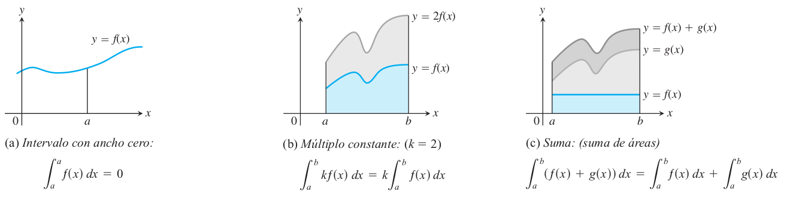
```


```{r FigEvSumasA01, fig.cap="Propiedades de la integral definida [Imagen tomada de [@thomas2003thomas] pág $268$]", fig.align='center' ,echo=FALSE, message=FALSE,  warning=FALSE, out.width = "85%"}
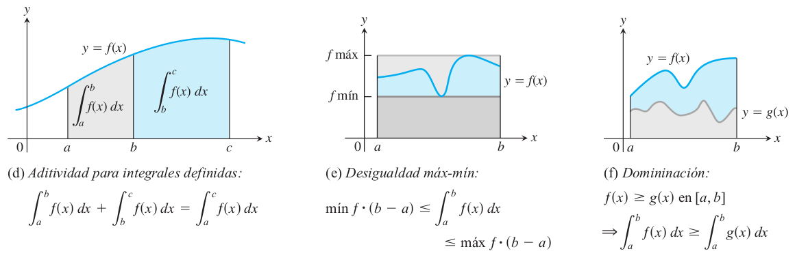
```

<br></br>

### Propiedades para las sumatorias

\[
\begin{matrix} 
(1.) & \displaystyle{\sum_{i=1}^{n}{c}}=cn \\
(2.) & \displaystyle{\sum_{i=1}^{n}{ca_i}}=c\displaystyle{\sum_{i=1}^{n}{a_i}} \\
(3.) & \displaystyle{\sum_{i=1}^{n}{(a_i+b_i)}}\displaystyle{\sum_{i=1}^{n}{a_i}}+\displaystyle{\sum_{i=1}^{n}{b_i}} \\
(4.) & \displaystyle{\sum_{i=1}^{n}{(a_i-b_i)}}\displaystyle{\sum_{i=1}^{n}{a_i}}-\displaystyle{\sum_{i=1}^{n}{b_i}} \\
\end{matrix}
\]


<br></br>

### Sumatorias para evaluar integrales definidas

\[
\begin{matrix} 
\text{ Sumatoria } & \text{ Fórmula } \\
\displaystyle{\sum_{i=1}^{n}{i}} & \dfrac{n(n+1)}{2} \\
\displaystyle{\sum_{i=1}^{n}{i^2}} & \dfrac{n(n+1)(2n+1)}{6} \\
\displaystyle{\sum_{i=1}^{n}{i^3}} & \left[\dfrac{n(n+1)}{2}\right]^2 \\
\end{matrix}
\]

<br></br>

### Ejemplo evaluación por sumatoria

```{example}
Determinar la integral definida 

\[
\displaystyle\int_{0}^{b}xdx  
\]

usando las sumatorias de evaluación.

tomada de [@thomas2003thomas] pág $268$]
```


```{r FigEvSumasA02, fig.cap="Área bajo la recta $y=x$ en el intervalo $[0,b]$ [Imagen tomada de [@thomas2003thomas] pág $268$]", fig.align='center' ,echo=FALSE, message=FALSE,  warning=FALSE, out.width = "25%"}
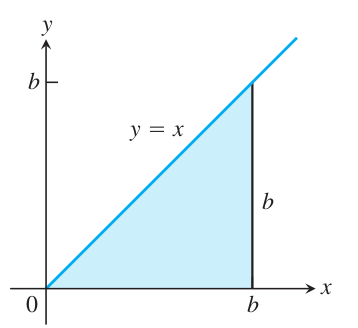
```


<br></br>


Para calcular la integral definida como el limite para sumas de Riemann, calulamos

$$
\displaystyle\lim_{\left\|P\right\| \to 0}\sum_{i=1}^{n}f(c_i)\triangle{x_i}=\displaystyle\int_{0}^{b}xdx 
$$

Así que consideremos la partición $P$ que divide el intervalo $[0,b]$ en $n$ subintervalos del mismo ancho $\triangle{x}=(b-a)/n=b/n$ y elegimos $c_i$ como el extremo derecho de cada subintervalo. La partición es:

$$
P=\left\{0,\dfrac{b}{n},\dfrac{2b}{n},\dfrac{3b}{n},\dfrac{4b}{n},,...,\dfrac{nb}{n},\right\}
$$

y $c_i=\dfrac{ib}{n}$, entonces tenemos

\[
\begin{equation} \label{eqSRimannA1}
\begin{split} 
\displaystyle\sum_{i=1}^{n}f(c_i)\triangle{x_i}& =\sum_{i=1}^{n}\dfrac{ib}{n}.\dfrac{b}{n}\\
& =\sum_{i=1}^{n}\dfrac{ib^2}{n^2}=\dfrac{b^2}{n^2}\sum_{i=1}^{n}i\\
& = \dfrac{b^2}{n^2}\left[\dfrac{n(n+1)}{2}\right]\\
& = \dfrac{b^2}{2}\left(1+\dfrac{1}{n}\right)\\
\displaystyle\lim_{\left\|P\right\| \to 0}\sum_{i=1}^{n}f(c_i)\triangle{x_i} & =\lim_{n \to {+}\infty}\dfrac{b^2}{2}\left(1+\dfrac{1}{n}\right)\\
& =\dfrac{b^2}{2}\lim_{n \to {+}\infty}\left(1+\dfrac{1}{n}\right)\\
& = \dfrac{b^2}{2}.1\\
& = \dfrac{b^2}{2}
\end{split}
\end{equation} 
\]


Se concluye que

$$
\displaystyle\lim_{\left\|P\right\| \to 0}\sum_{i=1}^{n}f(c_i)\triangle{x_i}=\displaystyle\int_{0}^{b}xdx =\dfrac{b^2}{2} \ \ \text{U.A.}
$$


<br></br>


## Integrales impropias tipo 1

```{definition}

(a) Si existe

$$
\displaystyle\int_{a}^{t}{f(x)dx}
$$
para todo número $t\geq a$, entonces

$$
\displaystyle\int_{a}^{\infty}{f(x)dx}=\lim_{t \to \infty}{\int_{a}^{t}{f(x)dx}}
$$

siempre y cuando existe este límite (como un número finito).


(b) Si existe

$$
\displaystyle\int_{t}^{b}{f(x)dx}
$$
para todo número $t\leq b$, entonces

$$
\displaystyle\int_{-\infty}^{b}{f(x)dx}=\lim_{t \to -\infty}{\int_{t}^{b}{f(x)dx}}
$$

siempre y cuando existe este límite (como un número finito).

Las integrales impropias se llaman convergentes si hay tal límite y divergentes si no existe.


(c) Si existe

$$
\displaystyle\int_{a}^{\infty}{f(x)dx} \quad \text{ y } \quad \displaystyle\int_{-\infty}^{a}{f(x)dx}
$$
son convergentes, entonces por definición

$$
\displaystyle\int_{-\infty}^{\infty}{f(x)dx}=\displaystyle\int_{-\infty}^{a}{f(x)dx}+\displaystyle\int_{a}^{\infty}{f(x)dx}
$$

se puede emplear cualquier número real $a$ en la parte (c).

Tomada de [@stewart2020calculus] pág $429$
```


**Interpretación geométrica de la integral impropia tipo Uno**

```{r FigIntegralImpropiaA01, fig.cap="Interpretación geométrica Área bajo la curva de una integral impropia [Imagen tomada de [@stewart2020calculus] pág $429$]", fig.align='center' ,echo=FALSE, message=FALSE,  warning=FALSE, out.width = "60%"}
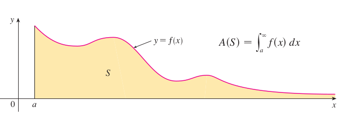
```

### Ejemplo1 integral impropia tipo Uno

```{example}
Evalúe la integral
$$
\displaystyle\int_{-\infty}^{\infty}{\dfrac{1}{1+x^2}dx}
$$

```


```{r FigIntegralImpropiaA02, fig.cap="Ejemplo área bajo la curva de una integral impropia [Imagen tomada de [@stewart2020calculus] pág $431$]", fig.align='center' ,echo=FALSE, message=FALSE,  warning=FALSE, out.width = "45%"}
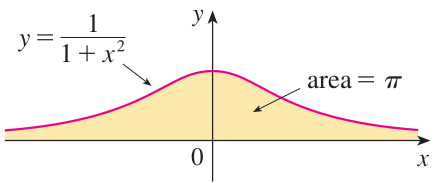
```


<br></br>


\[
\begin{equation} \label{eqIntImpropiaA0}
\begin{split}
\displaystyle\int_{-\infty}^{\infty}{\dfrac{1}{1+x^2}dx} 
& =\displaystyle\int_{-\infty}^{0}{\dfrac{1}{1+x^2}dx}+\displaystyle\int_{0}^{\infty}{\dfrac{1}{1+x^2}dx}\\
&  \\
&  \\
\displaystyle\int_{-\infty}^{0}{\dfrac{1}{1+x^2}dx} 
&=\lim_{t \to -\infty}{\int_{t}^{0}{\dfrac{1}{1+x^2}dx}}=\lim_{t \to -\infty}{\left. arctan(x)\right]_{t}^{0}}\\
& = \lim_{t \to -\infty}\left(arctan(0)-arctan(t)\right)=0-\left(\dfrac{-\pi}{2}\right)=\dfrac{\pi}{2}\\
&  \\
&  \\
\displaystyle\int_{0}^{\infty}{\dfrac{1}{1+x^2}dx} 
&=\lim_{t \to +\infty}{\int_{0}^{t}{\dfrac{1}{1+x^2}dx}}=\lim_{t \to +\infty}{\left. arctan(x)\right]_{0}^{t}}\\
& = \lim_{t \to +\infty}\left(arctan(t)-arctan(0)\right)=\lim_{t \to +\infty}{arctan(t)}=\dfrac{\pi}{2}\\
&  \\
&  \\
& \text{Se concluye que:}\\
\displaystyle\int_{-\infty}^{\infty}{\dfrac{1}{1+x^2}dx} & =\dfrac{\pi}{2}+\dfrac{\pi}{2}=\pi \quad \text{U.A.}
\end{split}
\end{equation} 
\]


<br></br>

### Ejemplo2 integral impropia tipo Uno

```{example}
Evalúe para que valores de $p$ la integral converge y en que valores de $p$ diverge
$$
\displaystyle\int_{1}^{\infty}{\dfrac{1}{x^p}dx}
$$
  
```

<br></br>


Supongamos que $p\neq 1$. Entonces

\[
\begin{equation} \label{eqIntImpropiaA1}
\begin{split}
\displaystyle\int_{1}^{\infty}{\dfrac{1}{x^p}dx} & = \lim_{t \to +\infty}{\int_{1}^{t}{\dfrac{1}{x^p}dx}}\\
& = \lim_{t \to +\infty}{\left. \dfrac{x^{1-p}}{1-p}\right]_{x=1}^{x=t}}\\
& = \lim_{t \to +\infty}{\left(\dfrac{1}{1-p}\right)\left[\dfrac{1}{t^{p-1}}-1\right]}\\
&  \\
&  \\
& \text{Si } \ \ p>1, \quad \text{ entonces } \ \ p-1>0. \quad \text{La integral converge} \\
\displaystyle\int_{1}^{\infty}{\dfrac{1}{x^p}dx} & = \lim_{t \to +\infty}{\left(\dfrac{1}{1-p}\right)\left[\dfrac{1}{t^{p-1}}-1\right]}=\dfrac{1}{p-1}\\
&  \\
&  \\
& \text{Si } \ \ p<1, \quad \text{ entonces } \ \ p-1<0. \quad \text{La integral diverge} \\
\displaystyle\int_{1}^{\infty}{\dfrac{1}{x^p}dx} & = \lim_{t \to +\infty}{\left(\dfrac{1}{1-p}\right)\left[\dfrac{1}{t^{p-1}}-1\right]}=\infty\\
\end{split}
\end{equation} 
\]


<br></br>

### Ejemplo3 integral impropia tipo Uno

```{example}
Evalúe la integral
$$
\displaystyle\int_{0}^{\infty}{\dfrac{8a^2dx}{x^2+4a^2}}
$$
  
```


<br></br>


\[
\begin{equation} \label{eqIntImpropiaA2}
\begin{split}
\displaystyle\int_{0}^{\infty}{\dfrac{8a^2dx}{x^2+4a^2}} & =\lim_{t \to +\infty}{\int_{0}^{t}{\dfrac{8a^2dx}{x^2+4a^2}}}\\
& =\lim_{t \to +\infty}{\int_{0}^{t}{\dfrac{8a^2dx}{x^2+4a^2}}}=\lim_{t \to +\infty}{\left. 4a^2arctan\left(\dfrac{x}{2a}\right)\right]_{0}^{t}}\\
& =4a^2\lim_{t \to +\infty}{\left[arctan\left(\dfrac{t}{2a}\right)\right]}=4a^2.\dfrac{\pi}{2}=2a^2\pi
\end{split}
\end{equation} 
\]


<br></br>

### Ejemplo4 integral impropia tipo Uno

```{example}
Evalúe la integral $(p=1)$.
$$
\displaystyle\int_{1}^{\infty}{\dfrac{1dx}{x}}
$$
  
```

<br></br>


\[
\begin{equation} \label{eqIntImpropiaA3}
\begin{split}
\displaystyle\int_{1}^{\infty}{\dfrac{1dx}{x}} & = \lim_{t \to +\infty}{\int_{1}^{t}{\dfrac{1dx}{x}}}\\
& = \lim_{t \to +\infty}\left(ln|t|-ln(1)\right)=\lim_{t \to +\infty}ln|t|=\infty
\end{split}
\end{equation} 
\]
No existe el límite de $ln|t|$ cuando $t$ aumenta sin límite. Entonces se concluye que la integral impropia diverge.


<br></br>

## Integrales impropias tipo 2

**Interpretación geométrica de la integral impropia tipo Dos**

```{r FigIntegralImpropiaA03, fig.cap="Interpretación geométrica área bajo la curva de una integral impropia tipo II [Imagen tomada de [@stewart2020calculus] pág $432$]", fig.align='center' ,echo=FALSE, message=FALSE,  warning=FALSE, out.width = "85%"}
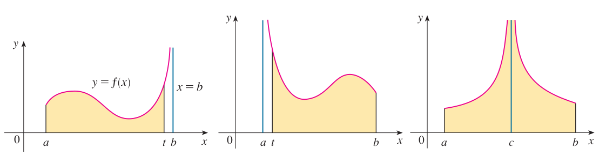
```


```{definition}

(a.) Si $f$ es continua en $[a,b)$ y discontinua en $x=b$, entonces

$$
\displaystyle\int_{a}^{b}{f(x)dx}=\lim_{t \to b^{-}}{\int_{a}^{t}{f(x)dx}}
$$
Si este límite existe, como un número finito.

(b.) Si $f$ es continua en $(a,b]$ y discontinua en $x=a$, entonces

$$
\displaystyle\int_{a}^{b}{f(x)dx}=\lim_{t \to a^{+}}{\int_{t}^{b}{f(x)dx}}
$$
Si este límite existe, como un número finito. Las integrales impropias se llaman convergentes si hay tal límite y divergentes si no existe.


(c.) Si $f$ tiene una discontinuidad en $x=c$ y $a<c<b$, y si son convergentes tanto
  
$$
\displaystyle\int_{a}^{c}{f(x)dx} \quad \text{ como } \quad \displaystyle\int_{c}^{b}{f(x)dx}
$$
por definición

$$
\displaystyle\int_{a}^{b}{f(x)dx}=\displaystyle\int_{a}^{c}{f(x)dx}+\displaystyle\int_{c}^{b}{f(x)dx}
$$
  
Tomada de [@stewart2020calculus] pág $432$
```


<br></br>

### Ejemplo1 Integral impropia tipo 2 caso (b)

```{example}
Evalúe la integral

$$
\displaystyle\int_{2}^{5}{\dfrac{1dx}{\sqrt{x-2}}}
$$
Tomada de [@stewart2020calculus] pág $433$
```


```{r FigIntegralImpropiaA04, fig.cap="Interpretación geométrica área bajo la curva. Integral impropia tipo II parte (b)[Imagen tomada de [@stewart2020calculus] pág $433$]", fig.align='center' ,echo=FALSE, message=FALSE,  warning=FALSE, out.width = "45%"}
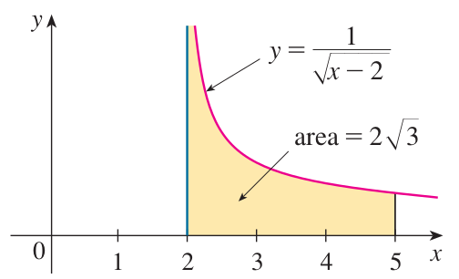
```

<br></br>


Es bueno resaltar que $f(x)=1/\sqrt{x-2}$ tiene una asíntota en $x=2$. Es decir $f$ es discontinua en $(2,5]$. Entonces aplicando el caso (b) se tiene

\[
\begin{equation} \label{eqIntImpropiaA4}
\begin{split}
\displaystyle\int_{2}^{5}{\dfrac{1dx}{\sqrt{x-2}}} & =\lim_{t \to 2^{+}}\int_{t}^{5}{\dfrac{1dx}{\sqrt{x-2}}}=\lim_{t \to 2^{+}}\left. 2\sqrt{x-2} \right]_{t}^{5} \\
& = 2\lim_{t \to 2^{+}}\left(\sqrt{3}-\sqrt{t-2}\right)\\
& = 2\sqrt{3}
\end{split}
\end{equation} 
\]


<br></br>

### Ejemplo2 Integral impropia tipo 2 caso (a)

```{example}
Evalúe la integral

$$
\displaystyle\int_{0}^{1}{\dfrac{1dx}{\sqrt{1-x^2}}}
$$
Tomada de [@stewart2020calculus] pág $485$
```

<br></br>


Es bueno resaltar que $f(x)=1/\sqrt{1-x^2}$ tiene una asíntota en $x=1$. Es decir $f$ es discontinua en $[0,1)$. Entonces aplicando el caso (a) se tiene

\[
\begin{equation} \label{eqIntImpropiaA5}
\begin{split}
\displaystyle\int_{0}^{1}{\dfrac{1dx}{\sqrt{1-x^2}}} & =\lim_{t \to 1^{-}}\int_{0}^{t}{\dfrac{1dx}{\sqrt{1-x^2}}}=\lim_{t \to 1^{-}}\left[arcsen(x) \right]_{0}^{t}\\
& = \lim_{t \to 1^{-}}\left(arcsen(t)-arcsen(0)\right)\\
& = \dfrac{\pi}{2}-0=\dfrac{\pi}{2}
\end{split}
\end{equation} 
\]


<br></br>

### Ejemplo3 Integral impropia tipo 2 caso (c)

```{example}
Evalúe la integral

$$
\displaystyle\int_{0}^{3}{\dfrac{1dx}{x-1}}
$$

```

<br></br>


Es bueno resaltar que $f(x)=1/(x-1)$ tiene una asíntota en $x=1$. Es decir $f$ es discontinua en $[0,3]$. Entonces aplicando el caso (c) se tiene

\[
\begin{equation} \label{eqIntImpropiaA6}
\begin{split}
\displaystyle\int_{0}^{3}{\dfrac{1dx}{x-1}} &=\displaystyle\int_{0}^{1}{\dfrac{1dx}{x-1}}+\displaystyle\int_{1}^{3}{\dfrac{1dx}{x-1}}\\
& \\
\text{Resolviendo la primera integral así:} &\\
\displaystyle\int_{0}^{1}{\dfrac{1dx}{x-1}} & =\lim_{t \to 1^{-}}\int_{0}^{t}{\dfrac{1dx}{x-1}}=\lim_{t \to 1^{-}}\left[ln|x-1| \right]_{0}^{t}\\
& = \lim_{t \to 1^{-}}\left(ln|t-1|-ln|-1|\right) = \lim_{t \to 1^{-}}\left(ln|t-1|\right) =-\infty\\ 
\text{Se concluye que la primera integral diverge} &\\
\end{split}
\end{equation} 
\]
Por lo tanto la integral planteada

$$
\displaystyle\int_{0}^{3}{\dfrac{1dx}{x-1}} 
$$
Es divergente y no es necesario evaluar la inegral $\displaystyle\int_{1}^{3}{\dfrac{1dx}{x-1}}$


<br></br>

## Teorema de comparacion para integrales impropias


```{r FigIntegralImpropiaA05, fig.cap="Teorema de comparación de integrales impropias [Imagen tomada de [@stewart2020calculus] pág $434$]", fig.align='center' ,echo=FALSE, message=FALSE,  warning=FALSE, out.width = "45%"}
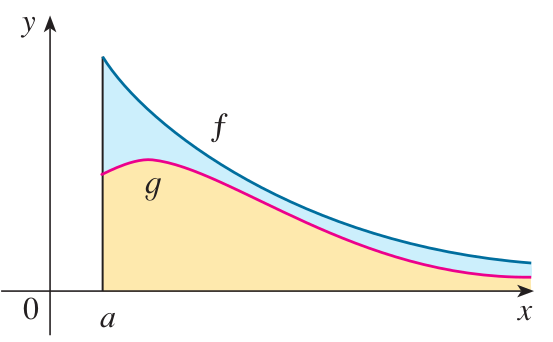
```


```{theorem}
Supongamos que $f$ y $g$ son funciones continuas  con la propiedad de que $f(x) \geq g(x) \geq 0$ para $x \geq a$.

(a.) Si 

\[
\displaystyle\int_{a}^{\infty}{f(x)dx}
\]
  
es convergente, entonces 

\[
\displaystyle\int_{a}^{\infty}{g(x)dx}
\]
es convergente.


(b.) Si 

\[
\displaystyle\int_{a}^{\infty}{g(x)dx}
\]
  
es divergente, entonces 

\[
\displaystyle\int_{a}^{\infty}{f(x)dx}
\]
  
es divergente.
```


<br></br>

### Ejemplo teorema de comparacion para integrales impropias

```{r FigIntegralImpropiaA06, fig.cap="Ejemplo teorema de comparación de integrales impropias [Imagen tomada de [@stewart2020calculus] pág $435$]", fig.align='center' ,echo=FALSE, message=FALSE,  warning=FALSE, out.width = "45%"}
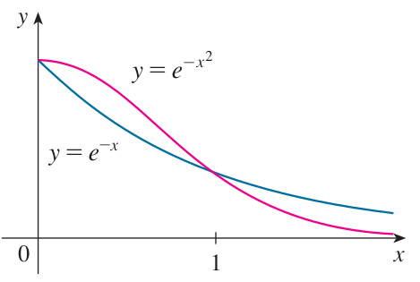
```


```{example}
Mostrar que la integral impropia 

$$
\displaystyle\int_{0}^{\infty}{e^{-x^2}dx}
$$

es convergente para toda $x \geq 1$
```


<br></br>


Sabemos que

$$
\displaystyle\int_{0}^{\infty}{e^{-x^2}dx}=\displaystyle\int_{0}^{1}{e^{-x^2}dx}+\displaystyle\int_{1}^{\infty}{e^{-x^2}dx}
$$
Además sabemos que para $f(x)=e^{-x}$
$$
\displaystyle\int_{1}^{\infty}{e^{-x}dx}=\lim_{t \to \infty}\int_{1}^{t}{e^{-x}dx}=\lim_{t \to \infty}\left(e^{-1}-e^{-t}\right)=e^{-1}, \ \ \text{es decir converge}
$$


Así que para aplicar el teorma de comparación para dos integrales impropias tomaremos:

$f(x)=e^{-x}$ y $g(x)=e^{-x^2}$. Vemos que se cumple:

$$
f(x)=e^{-x} \geq g(x)=e^{-x^2} \geq 0 \quad  \text{ para } x \geq 1
$$

Se puede ver de la gráfica arriba.

Entonces por el teorema de comparación se concluye que:


$$
\displaystyle\int_{0}^{\infty}{e^{-x^2}dx}
$$
es convergente para $x \geq 1$


## Aproximación numérica de la integral definida

### Ejemplo Regla de Trapecios

<br></br>


```{r , echo=FALSE}
library(knitr)
knitr::include_app("https://johneaces2021agosto.shinyapps.io/ReglaAproxIntegralUnoA_3/",height = "1200px")
```


### Ejemplo Regla de Simpson $1/3$

<br></br>


```{r , echo=FALSE}
library(knitr)
knitr::include_app("https://johneaces2021agosto.shinyapps.io/ReglaAproxIntegralUnoA_4/",height = "1200px")
```


