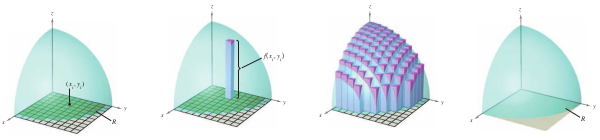
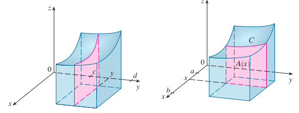
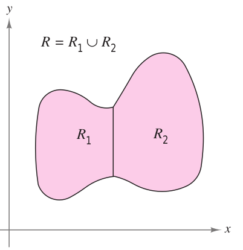
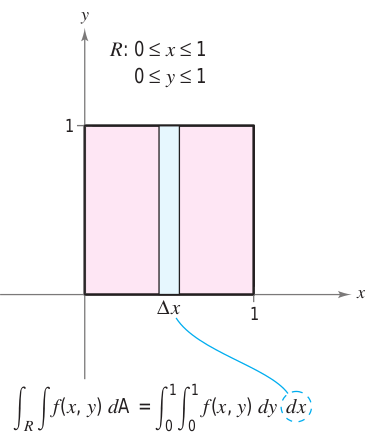
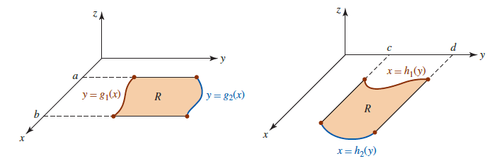

# Integrales dobles

<!-- <a href="https://www.lifeder.com/wp-content/uploads/2017/01/alan-turing.jpg"><div align="center"></div></a> -->


<div align="center">
<figure>
  

  <figcaption>Alan Turing (1912-1954).</figcaption>
</figure>
</div>


## Definición de integral doble

```{definition}
Si $f$ esta definida en una región cerrada y acotada $D$ del plano $XY$, entonces la integral doble de f sobre $D$ esta dada por[Tomado de [@larson2006calculo] pág $994$]
```

$$
\int_{D}\int{f(x,y)dA} =\lim_{{\parallel{\bigtriangleup}\parallel} \to 0}\sum_{i=1}^{n}f(x_i,y_i){\bigtriangleup}A_i
$$


siempre que el límite exista. Si existe el límite, entonces $f$ es integrable sobre la región $D$ en el plano  $XY$.


```{r FigDefVolumenA2, fig.cap="Partición regular para obtener el volumen de un sólido [Imagen tomada de [@larson2006calculo] pág $992$]", fig.align='center' ,echo=FALSE, message=FALSE,  warning=FALSE, out.width = "95%"}

```


<br></br>


Esta es una aplicación para generar un sólido en 3D, el Autor:John Jairo Estrada (https://www.geogebra.org/classic/nbzsjxsj) la elaboro usando geogebra.

<meta name=viewport content="width=device-width,initial-scale=1">
<meta charset="utf-8"/>
<script src="https://www.geogebra.org/apps/deployggb.js"></script>
<div id="ggb-elementSuperficiejjN01"></div> 
<script>  
       var ggbAppSuperficiejjN01 = new GGBApplet({"material_id":"nbzsjxsj",
       "width": 800,
       "height": 400,
       "showToolBar": false,
       "showAlgebraInput": false,
       "showMenuBar": false },
       true);
       
         window.addEventListener("load", function() {  
           ggbAppSuperficiejjN01.inject('ggb-elementSuperficiejjN01');
      });
</script>


<br></br>


## Definición de volumen para una región sólida


```{r FigDefVolumenAN1, fig.cap="Definición de volumen como integral doble [Imagen tomada de [@stewart2009calculus] pág $850$ y $851$]", fig.align='center' ,echo=FALSE, message=FALSE,  warning=FALSE, out.width = "95%"}

```


```{definition}
Si $f$  es integrable sobre una región $D$ del plano $XY$ y $f(x,y) \geq 0$ para todo $(x,y) \in D$, entonces el volumen de la región sólida que se encuentra sobre $D$ y bajo la gráfica de $f$ se define como:

Si 
$$
A(x)=\int_{c}^{d}{f(x,y)dy}
$$

$$
V(\text{región sólida})=\int_{D}\int{f(x,y)dA}=\int_{a}^{b}{A(x)dx}=\int_{a}^{b}{\int_{c}^{d}{f(x,y)dy}dx}
$$
  
donde $D=[a,b]\times [c,d]$
[Tomado de [@larson2006calculo] pág $994$]
```


## Propiedades de las integrales dobles


```{theorem}
Sean $f$ y $g$ continuas en una región cerrada y acotada $D$ del plano $XY$, y sea $c$ una constante. Cada una de las siguientes afirmaciones es verdadera: [Tomado de [@larson2006calculo] pág $994$]
```


```{r FigIntegralDoble1, fig.cap="Dos regiones no se sobreponen si su intersección es un conjunto de área cero. [Imagen tomada de [@larson2006calculo] pág $994$]", fig.align='center' ,echo=FALSE, message=FALSE,  warning=FALSE}

```


  (1.) $\int_{D}\int{cf(x,y)dA}=c\int_{D}\int{f(x,y)dA}$
   
  (2.) $\int_{D}\int{\left[f(x,y) \pm g(x,y) \right] dA} = \int_{D}\int{f(x,y)dA} \pm \int_{D}\int{g(x,y)dA}$
  
  (3.) $\int_{D}\int{f(x,y)dA}\geq 0$,    si $f(x,y)\geq 0$
  
  (4.) $\int_{D}\int{cf(x,y)dA}\geq \int_{D}\int{g(x,y)dA}$,      si $f(x,y) \geq g(x,y)$
  
  (5.) Si $D=R_1 \cup R_2$, entonces $\int_{D}\int{cf(x,y)dA}=\int_{R_1}\int{f(x,y)dA}+\int_{R_2}\int{f(x,y)dA}$
  
  

## Ejemplo integral doble usando geogebra


```{example}
Sea $D$ el rectángulo definido como $\left[0,1\right] \times \left[-3,3\right]$ y $f(x,y)=\dfrac{xy^2}{x^2+1}$ una función integrable en $D$. Obtener usando geogebra el volumén limitado arriba por $f$, y abajo por el rectángulo $D$. Observe que $f(x,y) \geq 0$ para todo $(x,y) \in D$   [Tomado de [@larson2006calculo] pág $994$]
```


<br></br>


Esta es una aplicación que genera un sólido y proporciona su volumen, inicialmente la realizó en youtube Matemática y Geogebra (https://www.youtube.com/watch?v=GfhDeC2lN88&t=857s), y posteriormente la realizó John Jairo Estrada (https://www.geogebra.org/classic/f6guccy3).

<meta name=viewport content="width=device-width,initial-scale=1">
<meta charset="utf-8"/>
<script src="https://www.geogebra.org/apps/deployggb.js"></script>
<div id="ggb-elementSuperficieC01"></div> 
<script>  
       var ggbAppSuperficieC01 = new GGBApplet({"material_id":"f6guccy3",
       "width": 900,
       "height": 600,
       "showToolBar": false,
       "showAlgebraInput": false,
       "showMenuBar": false },
       true);
       
         window.addEventListener("load", function() {  
           ggbAppSuperficieC01.inject('ggb-elementSuperficieC01');
      });
</script>


## Ejercicio integral doble

```{exercise}
Sea $D$ el rectángulo definido como $\left[0,1\right] \times \left[0,1\right]$ y $f(x,y)=1-\dfrac{1}{2}x^2-\dfrac{1}{2}y^2$ una función integrable en $D$. Además
$$
\left[0,1\right] \times \left[0,1\right]  \ \ \ \text{significa que:}  \ \ \  0\leq x \leq 1 \ \ \text{y} \ \ 0\leq y \leq 1
$$


 el volumén limitado arriba por $f$, y abajo por el rectángulo $D$. Observe que $f(x,y) \geq 0$ para todo $(x,y) \in D$   [Tomado de [@larson2006calculo] pág $996$]
```


```{r FigIntegralDoble2, fig.cap="El volumen de la región rectángular. [Imagen tomada de [@larson2006calculo] pág $996$]", fig.align='center' ,echo=FALSE, message=FALSE,  warning=FALSE,out.width = "50%"}

```


<br></br>


$$
  \int_{D}\int{1-\dfrac{1}{2}x^2-\dfrac{1}{2}y^2)dA}=\\
\int_{0}^{1}\int_{0}^{1}\left(1-\dfrac{1}{2}x^2-\dfrac{1}{2}y^2)\right)dydx=\\
\int_{0}^{1}\left[\left(1-\dfrac{1}{2}x^2\right)y -\dfrac{y^3}{6} \right]_{0}^{1}dx=\\
\int_{0}^{1}\left(\dfrac{5}{6}-\dfrac{1}{2}x^2\right)dx=\\
\left[\dfrac{5}{6}x-\dfrac{x^3}{6}\right]_{0}^{1}=\\
=\dfrac{2}{3}
$$

El ejercicio se puede ver solucionado en [@larson2006calculo] pág $996$]


<br></br>


```{r FigIntegralDobleAA1, fig.cap="Tipo de regiones en el plano cartesiano $XY$. [Imagen tomada de [@zill2011matematicas] pág $755$]", fig.align='center' ,echo=FALSE, message=FALSE,  warning=FALSE,out.width = "80%"}

```


```{theorem}
Supongamos que $f(x,y)$ es continuas en una región cerrada y acotada $D$ del plano $XY$. Si $D$ es una región verticalmente simple, entonces $D$ se puede describir en términos de desigualdades de la forma:

$$
D=\left\{ \begin{array}{lcc}
            \ \ \ \ \ a  \leq  x \leq b \\
             \\g_1(x) \leq  y  \leq g_2(x)
             \end{array}
   \right.
$$
  
y

$$
\int_{D}\int{f(x,y)dA}=\int_{a}^{b}\int_{g_1(x)}^{g_2(x)}{f(x,y)dydx}  
$$

  [Tomado de [@edwards1996calculo] pág $838$]
```

<br></br>

```{theorem}
Supongamos que $f(x,y)$ es continuas en una región cerrada y acotada $D$ del plano $XY$. Si $D$ es una región verticalmente simple, entonces $D$ se puede describir en términos de desigualdades de la forma:

$$
D=\left\{ \begin{array}{lcc}
            \ \ \ \ \ c  \leq  y \leq d \\
             \\h_1(y) \leq  x  \leq h_2(y)
             \end{array}
   \right.
$$
  
y

$$
\int_{D}\int{f(x,y)dA}=\int_{a}^{b}\int_{h_1(y)}^{h_2(y)}{f(x,y)dxdy}  
$$

  [Tomado de [@edwards1996calculo] pág $838$]
```


<br></br>

## Ejercicio integral doble

```{exercise}
Sea $D$ la región no rectángular definida como:
  
$$  
0\leq x \leq 1 \\ 
-\sqrt(\dfrac{4-x^2}{2}) \leq y \leq \sqrt(\dfrac{4-x^2}{2})
$$
  
 y $f(x,y)=4-x^2-2y^2$ una función integrable en $D$. Hallar el volumen del sólido limitado por abajo de la superficie $f(x,y)$, y por arriba de la región $D$ usando integrales dobles. [Tomado de [@larson2006calculo] pág $997$]
```


<br></br>

**NOTA:** Use la aplicación de geogebra para verificar su resultado.


Está es una aplicación de geogebra que realizó John Jairo Estrada (https://www.geogebra.org/classic/fdpb6ym8).
<meta name=viewport content="width=device-width,initial-scale=1">
<meta charset="utf-8"/>
<script src="https://www.geogebra.org/apps/deployggb.js"></script>
<div id="ggb-elementMate3SupeA01"></div> 
<script>  
       var ggbAppMate3SupeA01 = new GGBApplet({"material_id":"fdpb6ym8",
       "width": 1000,
       "height": 500,
       "showToolBar": false,
       "showAlgebraInput": false,
       "showMenuBar": false },
       true);
       
         window.addEventListener("load", function() {  
           ggbAppMate3SupeA01.inject('ggb-elementMate3SupeA01');
      });
</script>


<br></br>

## Regiones que generan dos integrales dobles


## Ejercicio integral doble

```{exercise}
Determinar el área usando integrales dobles para la región $D$ limitada por las curvas $x=-2$, $x=2$, $y=-x^2+2x$, y $y=3x^3-x^2-10x$. [Tomado de [@larson2006calculo] pág $997$]
```

<br></br>


$$
D_1=\left\lbrace (x,y) \in R^2, \ \ \text{tal que } \ \ -2 \leq x \leq 0; \ \ -x^2+2x \leq y \leq 3x^3-x^2-10x \right\rbrace 
$$
Por lo tanto el área de la región $D_1$ es:
$$
A(\text{Región }D_1)=\int_{-2}^{0}\int_{-x^2+2x}^{ 3x^3-x^2-10x}{1dydx}
$$
  
  
  
  
$$
D_2=\left\lbrace (x,y) \in R^2, \ \ \text{tal que } \ \ 0 \leq x \leq 2; \ \ 3x^3-x^2-10x \leq y \leq -x^2+2x \right\rbrace 
$$
Por lo tanto el área de la región $D_2$ es:
$$
A(\text{Región }D_2)=\int_{0}^{2}\int_{ 3x^3-x^2-10x}^{-x^2+2x}{1dydx}
$$
De donde el área total de la región $D_1 \cup D_2$ es:
  
$$
A(\text{Región }D_1 \cup D_2)=\int_{-2}^{0}\int_{-x^2+2x}^{ 3x^3-x^2-10x}{1dydx}+\int_{0}^{2}\int_{ 3x^3-x^2-10x}^{-x^2+2x}{1dydx}=24 \ \ \text{Unidades de área}
$$  

El ejercicio se puede ver solucionado en [@larson2006calculo] pág $996$]


<br></br>

<br></br>

Está es una aplicación de geogebra que realizó John Jairo Estrada (https://www.geogebra.org/classic/xbamdegy).
<meta name=viewport content="width=device-width,initial-scale=1">
<meta charset="utf-8"/>
<script src="https://www.geogebra.org/apps/deployggb.js"></script>
<div id="ggb-elementMate3RegionC01"></div> 
<script>  
       var ggbAppMate3RegionC01 = new GGBApplet({"material_id":"xbamdegy",
       "width": 1000,
       "height": 600,
       "showToolBar": false,
       "showAlgebraInput": false,
       "showMenuBar": false },
       true);
       
         window.addEventListener("load", function() {  
           ggbAppMate3RegionC01.inject('ggb-elementMate3RegionC01');
      });
</script>


<br></br>


Está es una aplicación de geogebra que realizó John Jairo Estrada (https://www.geogebra.org/classic/wjkumhwb).
<meta name=viewport content="width=device-width,initial-scale=1">
<meta charset="utf-8"/>
<script src="https://www.geogebra.org/apps/deployggb.js"></script>
<div id="ggb-elementMate3RegionC02"></div> 
<script>  
       var ggbAppMate3RegionC02 = new GGBApplet({"material_id":"wjkumhwb",
       "width": 1000,
       "height": 600,
       "showToolBar": false,
       "showAlgebraInput": false,
       "showMenuBar": false },
       true);
       
         window.addEventListener("load", function() {  
           ggbAppMate3RegionC02.inject('ggb-elementMate3RegionC02');
      });
</script>


<br></br>

## Ejercicio integral doble

```{exercise}
Obtener la gráfica del sólido generado en el primer octante, por la intersección de las superficies en el espacio $XYZ$:

\begin{equation}
z^2+x^2=9 \ \ \ \   : \text{Cilíndro}  \ \ \ \\
y=2, \ \ y=4 \ \ \ \   : \text{Planos paralelos al plano } \ XZ  \ \ \ \\
z=0, \ \ \ \   : \text{Plano} \ XY  \ \ \ \\
\end{equation}. [Tomado de [@larson2006calculo] pág $997$]
```


<br></br>


Esta es una aplicación para generar las gráficas de cada una de las superficies que plantea el ejemplo, realizado inicialmente por Mate.Math-University en youtube (https://www.youtube.com/watch?v=cqSPDNFZZ9U) el Autor en este ejemplo:John Jairo Estrada (https://www.geogebra.org/classic/rrswnzgr) la elaboro usando geogebra.

<meta name=viewport content="width=device-width,initial-scale=1">
<meta charset="utf-8"/>
<script src="https://www.geogebra.org/apps/deployggb.js"></script>
<div id="ggb-elementSuperficieB02"></div> 
<script>  
       var ggbAppSuperficieB02 = new GGBApplet({"material_id":"rrswnzgr",
       "width": 900,
       "height": 600,
       "showToolBar": false,
       "showAlgebraInput": false,
       "showMenuBar": false },
       true);
       
         window.addEventListener("load", function() {  
           ggbAppSuperficieB02.inject('ggb-elementSuperficieB02');
      });
</script>


<br></br>


En este momento se puede ver el sólido después de retirar los planos y las otras superficies que generaron el sólido pedido en el ejercicio 6.3

Esta es una aplicación para generar un sólido límitado por varias superficies, realizado inicialmente por Mate.Math-University en youtube (https://www.youtube.com/watch?v=cqSPDNFZZ9U) el Autor:John Jairo Estrada (https://www.geogebra.org/classic/baxbk5pz) la elaboro usando geogebra.

<meta name=viewport content="width=device-width,initial-scale=1">
<meta charset="utf-8"/>
<script src="https://www.geogebra.org/apps/deployggb.js"></script>
<div id="ggb-elementSuperficieB01"></div> 
<script>  
       var ggbAppSuperficieB01 = new GGBApplet({"material_id":"baxbk5pz",
       "width": 600,
       "height": 600,
       "showToolBar": false,
       "showAlgebraInput": false,
       "showMenuBar": false },
       true);
       
         window.addEventListener("load", function() {  
           ggbAppSuperficieB01.inject('ggb-elementSuperficieB01');
      });
</script>


**Solución**

Realice la sustitución que se indica para obtener el volumen del sólido

$$
D_1=\left\lbrace (x,y) \in R^2, \ \ \text{tal que } \ \ 0 \leq x \leq 3; \ \ 2 \leq y \leq 4; \ \  \ \ z=f(x,y)=\sqrt{9-x^2} \right\rbrace 
$$


<br></br>


Esta es una aplicación que genera un sólido y proporciona su volumen, inicialmente la realizó en youtube Matemática y Geogebra (https://www.youtube.com/watch?v=GfhDeC2lN88&t=857s), y posteriormente la realizó John Jairo Estrada (https://www.geogebra.org/classic/f6guccy3).

<meta name=viewport content="width=device-width,initial-scale=1">
<meta charset="utf-8"/>
<script src="https://www.geogebra.org/apps/deployggb.js"></script>
<div id="ggb-elementSuperficieCJ01"></div> 
<script>  
       var ggbAppSuperficieCJ01 = new GGBApplet({"material_id":"f6guccy3",
       "width": 900,
       "height": 600,
       "showToolBar": false,
       "showAlgebraInput": false,
       "showMenuBar": false },
       true);
       
         window.addEventListener("load", function() {  
           ggbAppSuperficieC01.inject('ggb-elementSuperficieCJ01');
      });
</script>


