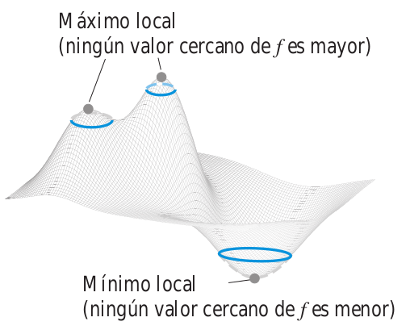
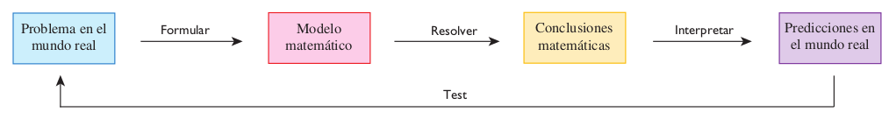

# Métodos de solución para Ecuaciones Diferenciales (EDO)

<!-- <a href="https://www.lifeder.com/wp-content/uploads/2017/01/Srinivasa-Ramanujan.jpg"><div align="center"></div></a> -->


<!-- <div align="center"> -->
<!-- <figure> -->
<!--   
<!--        alt="Srinivasa Ramanujan (1887-1920); -->
<!--            nacionalidad india famoso por la constante de Landau-Ramanujan" width="400" -->
<!--        height="341"> -->

<!--   <figcaption>Srinivasa Ramanujan (1887-1920).</figcaption> -->
<!-- </figure> -->
<!-- </div> -->


<br></br>

<!-- ## Significado geométrico de máximo y mínimo local -->

<!-- ```{r FigMaxMinA01, fig.cap="Concepto de máximo y mínimo local geometricamente [Imagen tomada de [@thomas2003thomas] pág $1028$]", fig.align='center' ,echo=FALSE, message=FALSE,  warning=FALSE, out.width = "65%"} -->
<!--  -->
<!-- ``` -->


<!-- Esta es una aplicación para obtener el valor de el Hessiano en un punto $(a,b)$ de una función $f(x,y)$, el Autor:John Jairo Estrada (https://www.geogebra.org/classic/ebw5zjfr) la elaboro usando geogebra. -->

<!-- <div align="center"> -->
<!-- <meta name=viewport content="width=device-width,initial-scale=1"> -->
<!-- <meta charset="utf-8"/> -->
<!-- <script src="https://www.geogebra.org/apps/deployggb.js"></script> -->
<!-- <div id="ggb-elementMaxMinA01"></div>  -->
<!-- <script>   -->
<!--        var ggbAppMaxMinA01 = new GGBApplet({"material_id":"ebw5zjfr", -->
<!--        "width": 800, -->
<!--        "height": 600, -->
<!--        "showToolBar": false, -->
<!--        "showAlgebraInput": false, -->
<!--        "showMenuBar": false }, -->
<!--        true); -->

<!--          window.addEventListener("load", function() {   -->
<!--            ggbAppMaxMinA01.inject('ggb-elementMaxMinA01'); -->
<!--       }); -->
<!-- </script> -->
<!-- </div> -->

```{r FigEDOA01, fig.cap="Modelado matemático [Imagen tomada de [@stewart2020calculus] pág $24$]", fig.align='center' ,echo=FALSE, message=FALSE,  warning=FALSE, out.width = "110%"}

```


## Definición para una Ecuación Diferencial

```{definition}
Es una ecuación que contiene una función desconocida $y$ y algunas de sus derivadas.
Un ejemplo de ecuación diferencial es el modelado matemático que con frecuencia toma está forma. Esto no es sorprendente, porque en los problemas del mundo real, es común observar que ocurran cambios y se desea predecir el comportamiento futuro con respecto a como cambian los valores actuales.

tomada de [@stewart2020calculus] pág $24$ y $567$
```


### Ejemplos de ecuaciones diferenciales

**Modelos de crecimiento poblacional**

\[
\boxed{
\dfrac{dP}{dt}=kP}
\]
donde $t$ represente al tiempo (variable independiente), y $P$ representa el número de individuos en la población (variable dependiente).


<br></br>

**Modelo logístico**


Existe evidencia considerable para apoyar la teoría de que para **algunas especies** hay una población mínima $m$ tal que las especies se extinguirán si el tamaño de la población cae por debajo de $m$.

\[
\boxed{
\dfrac{dP}{dt}=kP\left(1-\dfrac{Ṕ}{K}\right)\left(1-\dfrac{m}{P}\right)}
\]

donde $P$ es creciente si $m<P<K$, y $P$ es decreciente si $0<P<m$. Recordar que su **capacidad de soporte** es $K$.

<br></br>

**Modelo de la pesca para el hipogloso del Pacífico**

Esta pesca ha sido representada por

\[
\boxed{
\dfrac{dy}{dt}=ky\left(1-\dfrac{y}{K}\right)}
\]

donde $y(t)$ es la biomasa (la masa total de los integrantes de la población) en kilogramos en el tiempo $t$ (medido en años), la capacidad de soporte se estima como $K=8 \times 10^{7}kg$, y $k=0.71$ por año.

<br></br>

**Modelo depredador presa**

Aquí $R$ respresenta la población de conejos, y $W$ representa la población de depredadores. El sistema de ecuaciones diferenciales que modela ambas poblaciones es:

\[
\begin{matrix} 
(1.) &  \dfrac{dR}{dt}=kR-aRW \\ 
(2.) & \dfrac{dW}{dt}=-rW+bRW 
\end{matrix}
\]

donde $k,r,a,b$ son constantes positivas. Observe que el término $-aRW$ disminuye la rapidez de crecimiento natural de la presa, y el término $bRW$ incrementa la rapidez de crecimiento natural de los depredadores


<br></br>

**Modelos de mezclas**


\[
\boxed{
\dfrac{dy}{dt}=(\text{ proporción de entrada})-(\text{proporción de salida})}
\]

**Proporción de entrada** es la relación a la que la sal entra al recipiente y **proporción de salida** es la relación a la que la sal sale del recipiente.


<br></br>

**Modelos de la química**


En una reacción química elemental, las moléculas simples de dos reactivos $A$ y $B$ forman una molécula del producto $C$:

$$
A+B \ \longmapsto \ C
$$
La ley de acción de masas establece que la velocidad de reacción es proporcional al producto de las concentraciones de $A$ y $B$:

\[
\boxed{
\dfrac{d[C]}{dt}=k[A][B]}
\]


<br></br>

**Modelos de la ley de Newton para la gravitación universal**

Sabemos que la $F$ sobre un objeto de masa $m$ que ha sido proyectado verticalmente hacia arriba desde l superficie terrestre es:

$$
F=\dfrac{mgR^2}{(x+R)^2}
$$

donde $x=x(t)$ es la distancia del objeto arriba de la superficie en el tiempo $t$, $R$ es el radio de la Tierra y $g$ es la aceleración debida a la gravedad. Por la segundo ley de Newton $F=ma=m(dv/dt)$ y, por lo tanto,


$$
\boxed{
m\dfrac{dv}{dt}=-\dfrac{mgR^2}{(x+R)^2}}
$$

<br></br>

## Método para separar variables


```{definition}
Una ecuación diferencial de la forma:

\[
\dfrac{dy}{dx}=f(x,y)
\]
Se dice separable si $f$ puede ser expresado como

\[
f(x,y)=\dfrac{g(x)}{h(y)} \qquad \text{ ó } \qquad f(x,y)=g(x).h(y)
\]

Además

\[
\dfrac{dy}{dx}=f(x,y) \qquad \text{ es equivalente a } \qquad H(y)dy=G(x)dx
\]

```

<br></br>

### Ejemplo1 Ec Diferencial separable

```{example}
Resuelva la ecuación diferencial

\[
\dfrac{dy}{dx}=\dfrac{x^2}{y^2}
\]

y determine el valor de la constante $C$ bajo la condición inicial $y(0)=2$.
```


<br></br>


Como la ecuación diferencial es separable, ya que $f(x,y)=\dfrac{x^2}{y^2}$ tiene la forma $f(x,y)=\dfrac{g(x)}{h(y)}$, entonces se puede separar o reescribir en la forma:
  
$$
H(y)dy=G(x)dx  
$$
Es decir:
  
$$
y^2dy=x^2dx  \qquad \text{ Se ve que la variable} \ \ y \ \ \text{ quedo del lado izquierdo,}\\
\qquad \qquad \text{y a la} \ \ x \ \ \text{del lado derecho}
$$  
Integramos en ambos lados así:

\[
\begin{equation} \label{eqDifA01}
\begin{split}
\int{y^2dy} &= \int{x^2dx}+ C\\
\dfrac{x^3}{3} & = \dfrac{y^3}{3}+C
\end{split}
\end{equation} 
\]

Esta forma de presentación para la solución de la EDO se conoce como:
\[
\boxed{
  \dfrac{x^3}{3} = \dfrac{y^3}{3}+C} \quad \text{Solución implícita}
\]
Ahora se determinará el valor de $C$ usando la condición inicial $y((0)=2$. Importante dar interpretación a la condición inicial así:
                                                                     
\[
y(0)=2 \qquad \text{ es equivalente a afirmar que } \qquad x=0, \quad \text{ y } \quad y=2
\]
                                                                   
Reemplazando estos valores de $x$ y $y$ en la solución implícita se obtiene:

\[
\begin{equation} \label{eqDifA02}
\begin{split}
\dfrac{(0)^3}{3} & = \dfrac{(2)^3}{3}+C\\
0 & =\dfrac{8}{3}+C\\
\dfrac{-8}{3} & =C
\end{split}
\end{equation} 
\] 
Reemplazando en la solución implícita el valor obtenido para la constante $C$ tenemos:  
  
  
\[
\begin{equation} \label{eqDifA03}
\begin{split}
\dfrac{x^3}{3} & = \dfrac{y^3}{3}-\dfrac{8}{3}\\
3.\left(\dfrac{x^3}{3}\right) & =3.\left(\dfrac{y^3}{3}-\dfrac{8}{3}\right)\\
x^3 & = y^3-8\\
x^3+8 & = y^3\\
\sqrt[3]{x^3+8} & = y  \quad \text{esta presentación se conoce como solución explícita}
\end{split}
\end{equation} 
\] 


<br></br>

## Ec Diferencial lineal

```{definition}
Una ecuación diferencial se dice lineal si tiene la forma:
  
\[
\dfrac{dy}{dx}+P(x)y=Q(x)
\]
donde $P$ y $Q$ son funciones continuas en un intervalo $I$.

Además la solución de toda ecuación lineal tiene la forma:
  
\[
y(x)=\dfrac{1}{F(x)}\left[\int{F(x)Q(x)dx+C}\right], \quad \text{ donde }  \quad F(x)=e^{\int{P(x)dx}}\\
F \ \text{ se conoce como factor de integración. }
\]
```

<br></br>

### Ejemplo1 Mezclas

[Aplicación para resolver Mezclas](https://septiembreestradajohnjairo2021uces.shinyapps.io/EqDifUno/)


<br></br>

### Ejemplo1 Ec Dif lineal

```{example}
Considere una población $P=P(t)$ con rapidez de nacimiento y de mortalidad constante $\alpha$ y $\beta$, respectivamente y una relación $m$ de migración constante, donde $\alpha$, $\beta$, y $m$ son constantes positivas. Considere que $\alpha > \beta$. En tal caso la relación de cambio de la población en el tiempo $t$ se representa mediante la ecuación diferencial lineal:
\[
\dfrac{dP}{dt}=kP-m \qquad \text{donde } \qquad k=\alpha-\beta  
\]

Hallar la solución de esta ecuación que satisface la condición inicial $P(0)=P_0$.

tomada de [@zill2014calculo] pág $599$ ejercicio $13$
```


<br></br>

\begin{equation} \label{eqDifA04}
\begin{split}
\dfrac{dP}{dt} & =kP-m\\
\dfrac{dP}{dt}-kP & =-m, \qquad \text{de donde}
&\\
F(t)=e^{\int{-kdt}}=e^{-kt}; & \qquad \qquad Q(t)=-m
& \\
\text{Entonces} \qquad \qquad & \qquad \qquad  \\
P(t)= &  \dfrac{1}{e^{-kt}}\left[\int{-e^{-kt}mdt}+C\right]\\
P(t)= &  \dfrac{me^{-kt}}{ke^{-kt}}+e^{kt}C\\
P(t)= &  \dfrac{m}{k}+e^{kt}C \qquad \text{Forma explícita}\\
& \\
\text{Aplicando la condición inicial, se obtiene:} \qquad \qquad & \qquad \qquad  \\
P_0= &  \dfrac{m}{k}+C\\
P_0-\dfrac{m}{k} & = C
\end{split}
\end{equation} 


<br></br>

### Ejemplo2 Ec Dif lineal

```{example}
Sea $P(t)$ el nivel de desempeño de alguien que aprende una habilidad como función de tiempo de capacitación $t$. La gráfica de $P$ se llama curva de aprendizaje. Resolver la ecuación diferencial lineal
  
\[
\dfrac{dP}{dt}=k\left[M-P(t)\right], \qquad \text{Modelo razonable para el aprendizaje}
\]
donde $k$ es una constante positiva.

tomada de [@zill2014calculo] pág $607$ ejercicio $31$
```


<br></br>


\begin{equation} \label{eqDifA05}
\begin{split}
\dfrac{dP}{dt} & =k\left[M-P(t)\right]\\
& = kM-kP(t)\\
\dfrac{dP}{dt}+kP & =kM, \qquad \text{de donde}
&\\
F(t)=e^{\int{kdt}}=e^{kt}; & \qquad \qquad Q(t)=kM
& \\
\text{Entonces} \qquad \qquad & \qquad \qquad  \\
P(t)= &  \dfrac{1}{e^{kt}}\left[\int{e^{kt}kMdt}+C\right]\\
P(t)= &  \dfrac{kM}{e^{kt}}\left[\int{e^{kt}dt}+C\right]\\
P(t)= &  \dfrac{kM}{e^{kt}}\left[\dfrac{e^{kt}}{k}+C\right]\\
P(t)= &  M+C_1 \qquad \text{Presentación de la solución en forma explícita}\\
\end{split}
\end{equation} 


<br></br>

## Definición de transformada


```{theorem}
Sea $f$ una función definida para $t \geq 0$. Entonces se dice que la integral

$$
\mathscr{L}\{f(t)\}=F(s)=\int_{0}^{\infty}{e^{-st}f(t)dt}
$$
  
es la transformada de Laplace de $f$, siempre que la integral converja.

tomada [@zill2002ecuaciones] pág $256$
```

<br></br>

**NOTA:** La transformada es una transformación lineal.

$$
\mathscr{L}\{\alpha f(t)+\beta g(t)\}=\alpha \mathscr{L}\{f(t)\} + \beta \mathscr{L}\{g(t)\}
$$

<br></br>

### Ejemplo1 Transformada

```{example}
Obtener 

$$
  \mathscr{L}\{1\}
$$

tomada [@zill2002ecuaciones] pág $257$
```


<br></br>


Por definición de transformada se tiene:
  
  
\[
\begin{equation} \label{eqTLA1}
\begin{split}
\mathscr{L}\{1\} &= \int_{0}^{\infty}{e^{-st}1dt}=\displaystyle\lim_{b \to \infty}{\int_{0}^{b}{e^{-st}1dt}}\\
& = \displaystyle\lim_{b \to \infty}{\left. \dfrac{-e^{-st}}{s}\right|_{0}^{b}}\\
& = \displaystyle\lim_{b \to \infty}{\dfrac{-e^{-sb}+1}{s}}=\dfrac{1}{s}, \quad \text{siempre que } \ s>0
\end{split}
\end{equation}
\]

Ya que $e^{-st} \to 0$ conforme $t \to \infty$ para $s>0$.


<br></br>

### Ejemplo2 Transformada

```{example}
Obtener 

$$
  \mathscr{L}\{t\}
$$

tomada [@zill2002ecuaciones] pág $257$
```


<br></br>


Por definición de transformada se tiene:
  
  
\[
\begin{equation} \label{eqTLA2}
\begin{split}
\mathscr{L}\{t\} &= \int_{0}^{\infty}{e^{-st}tdt}=\displaystyle\lim_{b \to \infty}{\int_{0}^{b}{e^{-st}tdt}}\\
& = \displaystyle\lim_{b \to \infty}{\left. \dfrac{-te^{-st}}{s}\right|_{0}^{b}}+\dfrac{1}{s}\int_{0}^{\infty}{e^{-st}dt}\\
& = \dfrac{1}{s}\mathscr{L}\{1\}=\dfrac{1}{s}\left(\dfrac{1}{s}\right)=\dfrac{1}{s^2}, \quad \text{siempre que } \ s>0
\end{split}
\end{equation}
\]

Ya que $\displaystyle\lim_{t \to \infty}{te^{-st}}=0$, para $s>0$.


<br></br>

### Ejemplo3 Transformada

```{example}
Obtener 

$$
  \mathscr{L}\{e^{-3t}\}
$$

tomada [@zill2002ecuaciones] pág $257$
```


<br></br>


Por definición de transformada se tiene:
  
  
\[
\begin{equation} \label{eqTLA3}
\begin{split}
\mathscr{L}\{e^{-3t}\} &= \int_{0}^{\infty}{e^{-st}e^{-3t}dt}=\displaystyle\lim_{b \to \infty}{\int_{0}^{b}{e^{-(s+3)t}dt}}\\
& = \left.\dfrac{-e^{-(s+3)t}}{s+3}\right|_{0}^{\infty}\\
& = \dfrac{1}{s+3}, \quad s>-3.
\end{split}
\end{equation}
\]

Ya que $\displaystyle\lim_{t \to \infty}{e^{-(s+3)t}}=0$, para $s+3>0$.


## Tabla de transformadas


$$
\begin{matrix} 
\text{Función} \ f(t) & \text{Transformada} & \\
1 & \dfrac{1}{s} & \\
t & \dfrac{1}{s^2} & \\
t^{n} & \dfrac{n!}{s^{n+1}} & \\
e^{at} & \dfrac{1}{s-a} & \\
sen(kt) & \dfrac{k}{s^2+k^2} & \\
cos(kt) & \dfrac{s}{s^2+k^2} & \\
senh(kt) & \dfrac{k}{s^2-k^2} & \\
cosh(kt) & \dfrac{s}{s^2-k^2} & \\
f'(t) & sF(s)-f(0) & \\
f''(t) & s^2F(s)-sf(0)-f'(0) & \\
e^{at}f(t) & F(s-a) & \\
t^{n}f(t) & (-1)^{n}\dfrac{d^n}{ds^n}{F(s)} & \\
\end{matrix}
$$

<br></br>

## Métodos numéricos para resolver EDO

<br></br>

### Método de Euler


[Técnica general de Euler](https://johnjairoestradaalvarezuce2021sep.shinyapps.io/SolucionNumericaEulerBaseUnoA_1/)


<br></br>

### Método de Euler Mejorado

[Técnica general y mejorada de Euler](https://johnjairoestradaalvarezuce2021sep.shinyapps.io/SolucionNumericaEulerMejoradoBaseUnoA_1/)


<br></br>

### Método de Runge Kutta 4 (RK4)


[Técnica general de Runge Kutta cuatro](https://johnjairoestradaalvarezuce2021sep.shinyapps.io/SolNumRungeKutta4UnoA_1/)