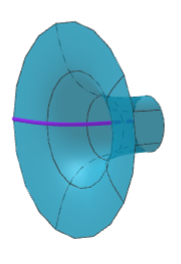

--- 
title: "Curso de Matemáticas Tres UCES"
author: "Carlos Andrés Escobar Guerra - Juan Alberto Arias Quiceno - John Jairo Estrada Alvarez"
date: "`r Sys.Date()`"
knit: bookdown::render_book
site: bookdown::bookdown_site
output:
includes:
      in_header: preamble.tex
documentclass: book
bibliography: [book.bib, packages.bib]
biblio-style: apalike
link-citations: yes
description: "Este texto se realizo usando bookdown package para escribir libros."
colorlinks: yes
graphics: yes
---


```{r setup, include=FALSE}
library(pracma)
library(plotly)
library(leaflet)
colFmt = function(x,color,outputFormat = 'html' ){
  # Funcion para colorear texto a discrecion en Rmarkdown
  # tomada de: https://stackoverflow.com/questions/29067541/how-to-change-the-font-color
  
  # outputFormat = knitr::opts_knit$get("rmarkdown.pandoc.to")
  if(outputFormat == 'latex')
    paste("\\textcolor{",color,"}{",x,"}",sep="")
  else if(outputFormat == 'html')
    paste("<font color='",color,"'>",x,"</font>",sep="")
  else
    x
}

```


<!--  -->


```{r include=FALSE}
# automatically create a bib database for R packages
knitr::write_bib(c(
  .packages(), 'bookdown', 'knitr', 'rmarkdown'
), 'packages.bib')

# manejo de fecha: "`r gsub(' 0', ' ', format(Sys.Date(), '%B %d, %Y'))`"
```

# Prerrequisitos

<!-- https://www.geogebra.org/classic/yxwbfgbk -->

<!-- https://www.geogebra.org/classic/py3nxdwq -->
El curso de matemáticas tres sólo tiene los siguientes prerrequisitios


```{tikz, Mate3A0, echo=F, fig.align="center", out.width = "36%"}
\begin{tikzpicture}[baseline=0]
  \draw[black, line width=2mm] (0, 0) circle (2.1);
  \draw[white, line width=2mm, overlay]
    \foreach \a in {0, 120, 240} {
      (0, 0) -- ++(\a:2.3)
    }
  ;
\draw (0,0) node {Matemáticas Tres};
\filldraw [gray] (1.8,-0.1) circle (2pt);
\draw (-1.98,0.3) .. controls (1,1) and (2,1) .. (1.8,0);
\draw (-0.7,2) .. controls (1,1) and (2,1) .. (1.8,0);
\draw (-0.55,-2) .. controls (1,1) and (2,1) .. (1.8,0);
\end{tikzpicture}\qquad

```


<!--  -->

<!-- <div align="center"></div> -->


<!-- <meta name=viewport content="width=device-width,initial-scale=1"> -->
<!-- <meta charset="utf-8"/> -->
<!-- <script src="https://www.geogebra.org/apps/deployggb.js"></script> -->
<!-- <div id="ggb-elementSuperficieJJA01"></div> -->
<!-- <script> -->
<!--        var ggbAppSuperficieJJA01 = new GGBApplet({"material_id":"yxwbfgbk", -->
<!--        "width": 700, -->
<!--        "height": 460, -->
<!--        "showToolBar": false, -->
<!--        "showAlgebraInput": false, -->
<!--        "showMenuBar": false }, -->
<!--        true); -->

<!--          window.addEventListener("load", function() { -->
<!--            ggbAppSuperficieJJA01.inject('ggb-elementSuperficieJJA01'); -->
<!--       }); -->
<!-- </script> -->


## Comportamentales


- Tener disposición para hacer silencio y generar un buen ambiente de escucha en el aula de clase.

- Tener la capacidad de acatar sugerencias para mejorar las técnicas de estudio ya adquiridas en procesos educativos pasados.

- Saber tomar nota mientras el profesor explica los temas de ese día.

- Repasar las notas de clase y complementar con la lectura del texto guía
según se avanza en el desarrollo temático del curso.


## Evaluativos

Tener los implementos básicos para una evaluación:

- Lapicero.

- Lapiz.

- Borrador.

- Calculadora.

- Todos los celulares apagados.

- Ir al baño antes de iniciar la evalualción.

- No hay preguntas en el desarrollo de la evaluación.

- Todas la maletas deben estar adelante.


## Fechas de evaluación 

* Evaluación de entrada **Virtual** (10 $\%$) - **Fecha: Lunes $07$ de Febrero**

* Primer parcial **Presencial** (17.5 $\%$) - **Fecha: Viernes $25$ de Febrero**

* Segundo Parcial **Virtual** (17.5 $\%$) - **Fecha: Viernes $25$ de Marzo**

* Tercer Parcial **Presencial** (17.5 $\%$) - **Fecha: Viernes $29$ de Abril**

* Fin de clases 29 de Mayo

* Cuarto Parcial **Virtual** (ó Parcial Final) (17.5 $\%$) - **Fecha: Viernes $03$ de Junio**


### Talleres evaluativos

* Primer Taller (5 $\%$) - **Fecha: Viernes $18$ de Febrero**

* Segundo Taller (5 $\%$) - **Fecha: Viernes $18$ de Marzo**

* Tercer Taller (5 $\%$) - **Fecha: Viernes $22$ de Abril**

* Cuarto Taller (5 $\%$) - **Fecha: Viernes $28$ de Mayo**


```{r echo=FALSE, message=FALSE}
library(calendR)
# calendR()
# calendR(year = 2020, month =8)
calendR(year = 2022, month = 02,        # Año y mes
        start = "M",                   # Empezar la semana en lunes
        text = c("Ev-Entrada","Fec íímite del taller","1Parcial"),
        text.pos = c(07,18,25),       # Días en los que poner los textos
        text.size = 3.5,               # Tamaño de fuente de los textos
        text.col = 2,
        special.days =  c(07,18,25),
        special.col = rgb(0, 0, 1,  alpha = 0.25),)
```


```{r echo=FALSE, message=FALSE}
library(calendR)
# calendR()
# calendR(year = 2020, month =8)
calendR(year = 2022, month = 03,        # Año y mes
        start = "M",                   # Empezar la semana en lunes
        text = c("Fec íímite del taller","2Parcial"),
        text.pos = c(18,25),       # Días en los que poner los textos
        text.size = 3.5,               # Tamaño de fuente de los textos
        text.col = 2,
        special.days =  c(18,25),
        special.col = rgb(0, 0, 1,  alpha = 0.25),)
```


```{r echo=FALSE, message=FALSE}
library(calendR)
# calendR()
# calendR(year = 2020, month =8)
calendR(year = 2022, month = 04,        # Año y mes
        start = "M",                   # Empezar la semana en lunes
        text = c("Fec íímite del taller","3Parcial"),
        text.pos = c(22,29),       # Días en los que poner los textos
        text.size = 3.5,               # Tamaño de fuente de los textos
        text.col = 2,
        special.days =  c(22,29),
        special.col = rgb(0, 0, 1,  alpha = 0.25),)
```


```{r echo=FALSE, message=FALSE}
library(calendR)
# calendR()
# calendR(year = 2020, month =8)
calendR(year = 2022, month = 05,        # Año y mes
        start = "M",                   # Empezar la semana en lunes
        text = c("Fec íímite del taller"),
        text.pos = c(28),       # Días en los que poner los textos
        text.size = 3.5,               # Tamaño de fuente de los textos
        text.col = 2,
        special.days =  c(28),
        special.col = rgb(0, 0, 1,  alpha = 0.25),)
```


```{r echo=FALSE, message=FALSE}
library(calendR)
# calendR()
# calendR(year = 2020, month =8)
calendR(year = 2022, month = 06,        # Año y mes
        start = "M",                   # Empezar la semana en lunes
        text = c("4Pacial"),
        text.pos = c(03),       # Días en los que poner los textos
        text.size = 3.5,               # Tamaño de fuente de los textos
        text.col = 2,
        special.days =  c(03),
        special.col = rgb(0, 0, 1,  alpha = 0.25),)
```


## Video motivacional 

**Todos tenemos un matemático interno**

Título del video en **youTube**:


<iframe width="560" height="315" src="https://www.youtube.com/embed/BbA5dpS4CcI" frameborder="0" allow="accelerometer; autoplay; encrypted-media; gyroscope; picture-in-picture" allowfullscreen></iframe>

Las matemáticas nos hacen libres y menos manipulables. [Página Web](https://www.youtube.com/watch?v=BbA5dpS4CcI).

<br></br>

**Así ve el mundo un matemático**


<iframe width="560" height="315" src="https://www.youtube.com/embed/eAcf73ulv9E" frameborder="0" allow="accelerometer; autoplay; encrypted-media; gyroscope; picture-in-picture" allowfullscreen></iframe>


Así ve el mundo un matemático [Página Web](https://www.youtube.com/watch?v=eAcf73ulv9E)


<br></br>

**El tipo que te convencerá de que las matemáticas son la profesión del futuro**

<iframe width="560" height="315" src="https://www.youtube.com/embed/NILudp6hti8" frameborder="0" allow="accelerometer; autoplay; clipboard-write; encrypted-media; gyroscope; picture-in-picture" allowfullscreen></iframe>

<br></br>


**Neil Degrasse: Los responsables de enseñar ciencia a los niños no tienen ni idea de lo que es**


<iframe width="560" height="315" src="https://www.youtube.com/embed/CVe8narE2PI" title="YouTube video player" frameborder="0" allow="accelerometer; autoplay; clipboard-write; encrypted-media; gyroscope; picture-in-picture" allowfullscreen></iframe>


<br></br>


**Cuando ya no esté: Neil Degrasse**


<iframe width="560" height="315" src="https://www.youtube.com/embed/MmHsKnjgGC4" title="YouTube video player" frameborder="0" allow="accelerometer; autoplay; clipboard-write; encrypted-media; gyroscope; picture-in-picture" allowfullscreen></iframe>


<br></br>

**Jack Andraka - Ingredientes clave para innovar**

<iframe width="560" height="315" src="https://www.youtube.com/embed/lFgQszLE6vM" title="YouTube video player" frameborder="0" allow="accelerometer; autoplay; clipboard-write; encrypted-media; gyroscope; picture-in-picture" allowfullscreen></iframe>


<br></br>


**Dan Kaminski: En internet hay siete llaves de seguridad y yo tengo una de ellas**


<iframe width="560" height="315" src="https://www.youtube.com/embed/B-icPvF3RG8" title="YouTube video player" frameborder="0" allow="accelerometer; autoplay; clipboard-write; encrypted-media; gyroscope; picture-in-picture" allowfullscreen></iframe>


<br></br>

## Página para reforzar conceptos básicos

El siguiente link es una página para repasar conceptos basicos que requieras en tu formación. [Página Web ](https://www.thatquiz.org/)

# Desarrollo temático

## Objetivo general

Resolver problemas matemáticos en diferentes áreas del saber mediante el pensamiento lógico, utilizando las leyes y principios de la matemática, que le permita razonar de manera adecuada, con creatividad y responsabilidad.

## Objetivos específicos 

* Resolver problemas mediante el análisis y con la esperiencia obtenida de los cursos anteriores a matemáticas III.
* Resolver problemas mediante la el uso lógico del lenguaje de programación para R commander y geogebra, aplicados a complementar el desarrollo teórico en el curso.
*Resolver problemas de ingeniería y optimizar su solución mediante el análisis y la aplicación de derivar e integrar, con creativa y de forma organizada.


## **Clase a clase**


* Todas las reglas de derivación

* Regla 01 concepto de antiderivada

* Regla 02 integración por sustitución básica

* Regla 03 integración por partes (caso LIATE)

* Regla 03 integración por partes (caso TABLA)

* Regla 03 integración por partes (caso GENERAL)

* Repaso de trigonometría básica
  + Trigonometria en un triángulo rectángulo
  + Identidades básicas
  + Ángulos dobles


  
* Sustituciones trigonometricas
  + Caso Uno: $u^2-a^2$
  + Caso Dos: $a^2-u^2$
  + Caso Tres: $a^2+u^2$
  

 
* Fórmulas básicas de reducción

* Sustituciones trigonométricas especiales

* Fracciones parciales (Descomposición)
  + Integración a partir de la descomposición en fracciones parciales

  
* Integral definida (definición canónica)

* Propiedades de las integrales definidas

* Teorema fundamental del cálculo
  + Ejemplo función simple
  + Ejemplo función compuesta


* Aplicación 01: Área bajo una curva

* Aplicación 02: Área entre curvas

* Vectores en $R^2$ y $R^3$
  + Concepto de vector libre y coordenado
  + Operaciones con vectores
  + Distancia de un punto externo a un plano
  + Conjunto generador
  + Conjunto LI
  + Base canónica en $R^2$ y $R^3$
  
  
* Funciones con varias variables
   + Dominio y Rango


* Superficies básicas
   + Concepto de traza
   + Concepto curva de nivel
   + Planos paralelos a los planos coordenados
   + Esfera
   + Elipsoide
   + Paraboloide
   + Cono
   + Silla de montar
   + Hiperboloide de una hoja y dos hojas
   + Cilindros para cada eje coordenado en $R^3$
   + Canoa con su curva generatriz
   
   
* Concepto de límite para funciones de varias variables
  + Limite usando trayectorias
  + Límite usando desigualdades
  + Limite usando varios tipos de coordenadas en el plano y el espacio
  
  
* Concepto de derivada parcial como límite
  + Notación de derivada parcial
  


* Plano tangente a una superficie
  + Aplicaciónde plano tangente
  + Linealización en dos y tres variables
    
* Concepto de gradiente en dos y tres variables
  + Derivada direccional usando límite
  + Derivada direccional usando el concepto de gradiente
  
  
* Concepto de máximos y mínimos para funciones con dos y tres variable
  + Críterio de la segunda derivada parcial para máximos y mínimos
  + Críterio de los multiplicadores de Lagrange para máximos y mínimos
  
* Concepto de integral doble
  + Región de integración para una integral doble
  + Propiedades de las integrales dobles
  + Cambio de límites de integración en las integrales dobles
  + Área como integral doble
  + Volumen como integral doble
  + Integral doble en coordenadas polares
  
  
* Concepto de integral triple
  + Propiedades de las integrales triples
  + Región de integración sólida en $R^3$
  + Integrales triples en coordenadas cilindricas
  + Integrales triples en coordenadas esféricas


  


## Bibliografía

* HOFFMANN, Bradley, Sobecki, Price Sandoval. Matemáticas aplicadas a la administración y los negocios. 8 ed. Mc Graw Hill, 2014, 905p

* POOLE, David. Álgebra Lineal. Una Introducción Moderna. 2ª ed. México: Thomson, 2007, 712p.

* STEWART, James. Cálculo de una Variable. 6a ed. Ciudad de México: Cengage Learning, 2008. 883p.

* THOMAS junior, George y FINNEY, Ross L. Cálculo: Una Variable. 9a ed. Ciudad de México: Pearson, 1998. 707p.

* LEITHOLD, Lois. El Cálculo con Geometría Analítica. 7ª ed. Ciudad de México: Harla, 1998. 1344p.

* EDWARDS junior, C. H. y PENNEY, David E. Cálculo: Con Geometría Analítica. 4ª ed. Juárez: Pearson, 1996, 956p.


## Video manejo de la Casio $f_{x}350MS$


En este video se pretende dar unas pautas de como usar
la calculadora Casio (incluyendo versiones como $f_{x}82MS$)


<!-- ```{r Video1} -->
<!-- library(knitr) -->
<!-- knitr::include_url("https://www.youtube.com/watch?v=iwKqLbwDjgY") -->
<!-- ``` -->

<iframe width="560" height="315" src="https://www.youtube.com/embed/iwKqLbwDjgY" frameborder="0" allow="accelerometer; autoplay; encrypted-media; gyroscope; picture-in-picture" allowfullscreen></iframe>

[Calculadora Casio](https://www.youtube.com/watch?v=iwKqLbwDjgY)


### Regla de Cramer sistemas $2$ por $2$


<iframe width="560" height="315" src="https://www.youtube.com/embed/hMEyOtdJdXo" frameborder="0" allow="accelerometer; autoplay; encrypted-media; gyroscope; picture-in-picture" allowfullscreen></iframe>

[Regla de Cramer sistema 2 por 2](https://youtu.be/hMEyOtdJdXo)

### Regla de Cramer sistemas $3$ por $3$

<iframe width="560" height="315" src="https://www.youtube.com/embed/SpRbyapGhtk" frameborder="0" allow="accelerometer; autoplay; encrypted-media; gyroscope; picture-in-picture" allowfullscreen></iframe>

[Regla de Cramer sistemas 3 por 3](https://youtu.be/SpRbyapGhtk)


### Regla de Sarrus determinante $3$ por $3$

<iframe width="560" height="315" src="https://www.youtube.com/embed/bdLfefNCt9c" frameborder="0" allow="accelerometer; autoplay; encrypted-media; gyroscope; picture-in-picture" allowfullscreen></iframe>

 [Regla de Sarrus par obtener un determinantes 3 por 3](https://youtu.be/bdLfefNCt9c)

### Solución de la ecuación cuadrática

<iframe width="560" height="315" src="https://www.youtube.com/embed/DZa7OflVcB4" frameborder="0" allow="accelerometer; autoplay; encrypted-media; gyroscope; picture-in-picture" allowfullscreen></iframe>

[Ecuación cuadrática](https://youtu.be/DZa7OflVcB4)


